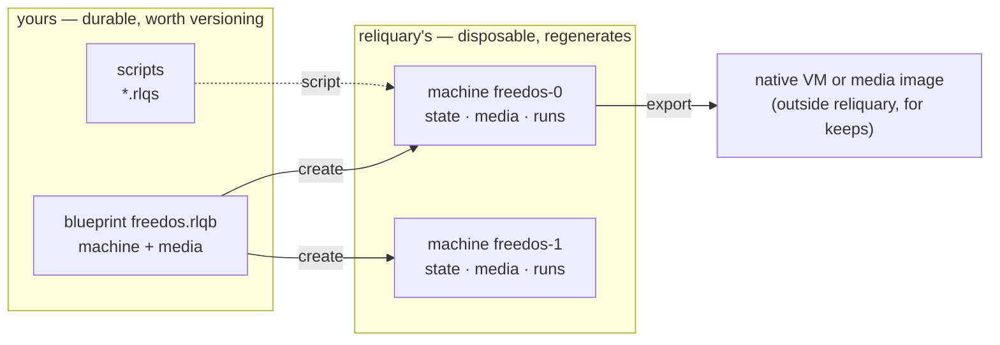
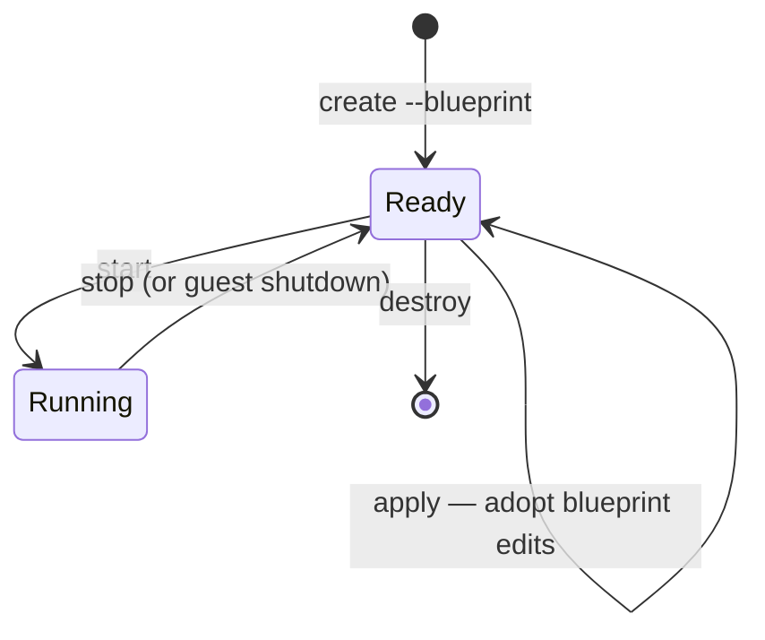

<!--
SPDX-FileCopyrightText: 2026 Paul Galbraith
SPDX-License-Identifier: GPL-3.0-only
-->

# Blueprint guide

> **Descriptive.** The format's norm is the published schema
> (`reliquary/schemas/blueprint-schema-v1.json`, structure) plus
> [the composed blueprint model](spec/blueprint-model.md)
> (semantics); where this guide disagrees with either, this guide
> has the bug.

> **Status:** implemented on the composed blueprint model — a machine's
> `drives` name **media** components ([media spec](spec/media-spec.md)),
> resolved from the `.rlqb` namespace, with empty removable slots
> (`null`), alongside `platform`, `memory`, `boot`, `description`, and
> `scripts`: parsing, validation, media-name resolution, machine
> materialization, and persistent script-driven `insert`/`eject`. The
> remaining fields may still change before first release; the composed
> model itself is worked out in
> [the composed blueprint model](spec/blueprint-model.md).

Every Reliquary machine begins with a reusable JSON **blueprint** and is
realized as separately identified **machines**. One blueprint can create
many machines. The blueprint is one file holding an array of
**specs** — a `machine` and the `media` it draws on; the detailed
ownership, state, locking, and recovery model is in
[Machine blueprints and machines](spec/instance-model.md).

## The model at a glance

A **blueprint** is a design you author and keep. A **machine** is
a disposable realization Reliquary builds from it — identified by
a generated id, cheap to destroy and rebuild, never the product.
When a result should outlive its machine, `export` carries it out.



Each machine then moves through a small lifecycle. Solid states
are where a machine rests; every verb is explicit, and nothing
tears a machine down or adopts a blueprint edit implicitly:



`recreate` is exactly `destroy` + `create` as one command, under
the same id; `clone` and `export` act on a Ready (stopped)
machine. What each verb touches — the CLI command is the API
twin's name, dash-separated (the identity rule,
docs/spec/cli.md):

| verb       | blueprint file           | the machine (`cache/machines/<id>/`)   | CLI / API twin     |
|------------|--------------------------|----------------------------------------|--------------------|
| `create`   | reads                    | materializes, under a new id           | `create-machine` / `create_machine` |
| `start`    | —                        | runs (as its state describes)          | `start-machine` / `start_machine` |
| `stop`     | —                        | powers off                             | `stop-machine` / `stop_machine` |
| `apply`    | reads                    | reconciles to edits, new baseline      | `apply-blueprint` / `apply_blueprint` |
| `destroy`  | —                        | deletes entirely                       | `destroy-machine` / `destroy_machine` |
| `recreate` | reads                    | regenerates, same id                   | `recreate-machine` / `recreate_machine` |
| `clone`    | —                        | new machine, new id, drives copied     | `clone-machine` / `clone_machine` |
| `delete`   | deletes (refuses while machines exist) | —                        | `delete-blueprint` / `delete_blueprint` |
| `export`   | —                        | copies out                             | `export-drive` / `export_drive`; `export-machine` / `export_machine` |

Every verb lands on the CLI and the embedding API together
(planning/INTERFACES.md): the twins are flat functions — the
shape every binding language can express — taking the same
selectors the CLI takes (a machine id, or the
blueprint/machine-number pair, with `resolve_machine()` the
shared resolution seam) plus the mirrored global keywords
(`home=`, `assets=`). Returns mirror what the
CLI prints — `create_machine` returns the new machine id — and
errors raise by class where the CLI exits by code. The mobility
twins are named but unbuilt (below): `clone_machine`,
`export_drive`, `export_machine`, and `import_vm` — the last
spelled that way because a bare `import` is a Python keyword in
the first binding.

Two rules carry the whole model:

- **Editing the blueprint never changes an existing machine by
  itself.** A machine keeps the resolved snapshot it was created
  from (its *baseline*); `apply` is the explicit step that adopts
  your edits. Between `apply`s the machine's own state is
  authoritative — operation (installer writes, script
  `insert`/`eject`) may legitimately diverge it from the
  baseline, and `start` runs the machine as its state describes,
  never silently reverting it.
- **Everything Reliquary materialized is disposable.** `destroy` +
  `recreate` rebuilds a machine wholesale from the blueprint — its
  machine, media, and archive components — and its scripts; nothing
  under `cache/` is ever precious.

## The documents

```text
<reliquary_home>/blueprints/
└── msdos.rlqb               reusable blueprint — yours
<reliquary_home>/cache/machines/<id>/
├── machine.json             the machine's state — reliquary's; while
│                            running, the live VM identity folds in
│                            as a `vm` section
├── media/                   per-machine materialized images, by
│                            media name
├── screenshots/             where the `screenshot` verb and an
│                            automatic failure capture land
└── <backend>/               the backend's own files (e.g. qemu/)
```

- The **blueprint** (`<name>.rlqb`) is the reusable machine shape
  you defined — the machine plus the media, source, and archive
  components it draws on, all in one file. You own it: Reliquary
  reads it and never writes it — `import` and the future `init`
  author one once, at your request, and never touch it again;
  `delete`, equally at your request, removes it.
- The **state** (`cache/machines/<id>/machine.json`)
  describes one machine: its identity, blueprint, lifecycle
  phase, and resolved configuration, at the root of the
  machine's directory — which holds everything Reliquary
  materialized for it: state, per-machine media images,
  screenshots, backend files. The machine **is** this directory;
  nothing about a machine lives outside `cache/`, because a machine
  lives and dies as one thing. Reliquary writes all of it and you
  never need to touch any of it: **a run stores nothing here**. It
  returns its output to whoever drove it — live progress as it
  goes, the result at the end — so there is no record in the
  machine to read in place or copy out.

The split reflects what Reliquary machines are for: **ephemeral
work**. A Reliquary machine is a disposable rig — created to run a
scripted OS install or an automated task, recreated freely, and
deleted when done. The blueprint makes rebuilding cheap; the
entire cached materialization is safe to throw away, because
everything in it regenerates from the blueprint (its media and
archive components) and its scripts. Nothing is excepted: a run
keeps no record here to lose. The machine is never the product —
**the result is** (U14): the point was to run some tests, and what
you get back is what the run returned, plus whatever file you
asked Reliquary to hand over, both already on your side of the
seam by the time the machine is disposable
([the run's output](spec/script-spec.md#the-runs-output-and-failure)).
When the durable thing is bigger, `export` it — either a media
image (a disk image taken out of the machine) or the entire
machine, handed to a hypervisor built for long-lived machines.
Reliquary is not the place to keep a machine you care about.

The same ownership line runs through the whole Reliquary home:
everything outside `cache/` is durable data you own. Blueprints —
each carrying its own media and archive components — and scripts
are small, shareable, and worth versioning. The [user properties
file](spec/script-properties.md)
is also durable but personal and normally not shared or committed.
Everything under `cache/` is Reliquary's, disposable, and
reconstructible without exception — a run leaves nothing there
that a rebuild could fail to reproduce. There is no dropping of
pre-created files into cache directories; inputs enter machines
through the blueprint — a drive names a
[`media`](blueprint-reference.md#drives) component, and the
media owns how it materializes (a fresh blank, a writable overlay
over a payload, a copy of one, or an attached payload).

This page explains the format and how these documents behave
through a machine's life. Companion pages:

- **[Field reference](blueprint-reference.md)** — every field,
  every rule.
- **[Cookbook](blueprint-cookbook.md)** — complete worked
  examples.
- **[The composed blueprint model](spec/blueprint-model.md)** — the
  format's **normative model**: the root shape, spec identity and
  the name charter, the location grammar, containment, and the
  reference closure. This guide teaches the format; that document
  defines it.
- **[The media spec](spec/media-spec.md)** — acquisition: how payloads
  are fetched, verified, cached, and reclaimed.
- **[Script properties](spec/script-properties.md)** — how scripts
  consume values: the source order, and the user file holding
  reusable personal values and protected secrets.

## What the blueprint format is

**It is backend-agnostic.** The same blueprint can describe a
machine on any supported virtualization backend — QEMU,
VirtualBox, VMware Workstation, or Hyper-V. Nothing in the core
format is a QEMU option or a VirtualBox setting in disguise. The
one deliberate exception is the
[`backend-settings`](blueprint-reference.md#backend-settings)
field, an explicitly scoped escape hatch; a blueprint that
doesn't use it is portable by construction — one checked-in
blueprint serves every developer's host (U4).

**A blueprint and its state are not the same format.** The blueprint is the
portable JSON document you author. The Reliquary-owned machine
state wraps its resolved form with identity, lifecycle, and
backend facts. See [the instance model](spec/instance-model.md).

**Machine specs have names; machines have ids.** A machine spec
declares its `name` — required, since the `.rlqb` file's own stem is
never an identity. `--blueprint <name>` selects the machine spec of
that name; its machine's identity is
`<name>-<n>`, and commands take `--machine <name>-<n>` — the full id,
exactly — with `--blueprint <name>` alone selecting the machine when
exactly one exists. Destroy frees the number for reuse on the next
`create`. Selection by name is scoped to the invocation's
resolution: a machine matches only when the name resolves —
through the asset root — to the same blueprint file the machine
[records](blueprint-reference.md#blueprint-source), so
same-named blueprints in different projects never select each
other's machines.

## A first example

A minimal blueprint that boots a DOS floppy image:

```json
{
  "type": "machine",
  "name": "msdos622",
  "platform": "dos",
  "drives": {
    "floppy": "msdos622-boot"
  }
}
```

This is a **lone spec object** — sugar for the array of one. It must
declare `"type": "machine"`, because `type` defaults to `media`
everywhere. The `floppy` drive names a media, `msdos622-boot`, that
Reliquary resolves from the catalog: a media spec in a sibling
`.rlqb`, or a codex media seeded on first reference. To ship the
machine and its media as one self-contained file, write the array —
`[ { "type": "machine", … }, { "type": "media", … } ]` (see
[the media spec](spec/media-spec.md) and
[cookbook](blueprint-cookbook.md)).

Save it as `msdos.rlqb` anywhere under your asset root — the
current directory by default, or the Reliquary home for the
shared personal collection; a `blueprints/` subdirectory is
optional organizational dressing (docs/spec/asset-resolution.md). Blueprints arrive written by hand, seeded
out of the
[codex](spec/codex.md) (implicitly on first
reference, or explicitly with `seed-blueprint`), synthesized from a native
VM by `import`, or scaffolded by the future `init` command.
Implicit seeding is the human-CLI half of the artifact-residency
split (ARCHITECTURE.md P4): it happens while autoseeding is on,
which is the CLI's default and never the embedding API's. Automation
runs project-scoped — `--blueprints-dir <dir> --no-autoseed`, where
the directory is the sole source and the codex is not a resolution
tier — and a project seeds a copy once with `seed-blueprint` and
commits it. Create a machine and run it:

```powershell
rlq create-machine --blueprint msdos
rlq start-machine --blueprint msdos --display
rlq stop-machine --blueprint msdos
```

`create` resolves the blueprint against an assigned backend,
materializes the machine under its id-named cache, and prints the
new id. With only one machine of the blueprint, `--blueprint msdos` selects
it everywhere; `--machine msdos-0` or `--blueprint msdos --machine 0`
always works and is required once a blueprint has several machines.

## Blueprint and state

### The blueprint — yours

A `.rlqb` file holds the machine shape as you defined it —
the file you authored, and whatever you edit it to later. Write as
little as possible and let resolution fill in the rest:

- Omit `backend` and Reliquary picks the best available one.
- Omit `memory`, `cpus`, or `control-planes` and the platform's
  defaults apply.
- Use shorthand: `"hdd"` instead of `"hdd0"`, a bare media-name
  string instead of an object.

Omissions are preserved, not baked in: a blueprint that omits
`memory` keeps tracking the platform default, even if that default
changes in a later Reliquary.

A blueprint may not contain
[state-only fields](blueprint-reference.md#state-only-fields);
`create` rejects a document carrying them.

**Editing the blueprint is the supported way to reconfigure a
machine — through the explicit `apply`.** A machine created from
a blueprint keeps the *resolved snapshot* of that blueprint as its
baseline; editing the blueprint file changes future `create`
operations, not existing machines. To adopt blueprint edits into an
existing machine, stop it and run
[`apply`](#applying-blueprint-edits). Nothing is ever adopted
implicitly at `start`.

### The state — Reliquary's

`cache/machines/<id>/machine.json` describes the machine as
it actually is, and Reliquary maintains it: whenever Reliquary
changes the machine — inserts media, changes memory, reorders
boot devices — it updates the state in the same operation. A
state document that disagrees with the hypervisor's actual
configuration is a bug in Reliquary, not an ambiguity you have to
resolve. While the machine is running the state also carries a
`vm` section — the live VM's identity and port — written
atomically with the lifecycle `phase` and cleared when it stops.

The state is fully resolved:

- shorthand keys and values are canonicalized (`"hdd"` → `"hdd0"`,
  a bare media name → a `media` object);
- platform defaults are materialized into explicit values;
- the assigned `backend` is recorded, along with the state-only
  fields: the machine's own `id` (repeated in the file as a safety
  check against a misplaced or hand-copied machine directory),
  `backend-id`, the resolved blueprint digest, and the blueprint's
  resolved source path — plus the
  machine's bookkeeping: its blueprint's name, creation time, and
  lifecycle phase. (A script's outcome is what its run returned to
  the caller — there is no `installed` flag, and nothing about the
  run is kept here.)

The blueprint from the [first example](#a-first-example)
produces, on a host where QEMU was selected:

```json
{
  "id": "msdos-0",
  "blueprint": "msdos",
  "created": "2026-07-19T18:20:11Z",
  "phase": "ready",
  "platform": "dos",
  "backend": "qemu",
  "backend-id": "reliquary-msdos-0",
  "memory": 16,
  "cpus": 1,
  "drives": {
    "floppy0": {
      "medium": "floppy",
      "slot": 0,
      "media": "msdos622-boot",
      "materialize": "use",
      "path": "<cache>/media/msdos622-boot.img"
    }
  },
  "boot": ["floppy0"],
  "control-planes": ["agentless-display"]
}
```

Each resolved drive records its `medium`/`slot`, the `media` it
names, how that media `materialize`s, and the realized cache
`path`. A running machine additionally carries a top-level `vm`
section.

Don't edit the state — or anything else under
`cache/machines/<id>/`. Reliquary rewrites the state as it
operates the machine, and reconciliation regenerates the backend's
configuration from the state; hand edits
are overwritten without notice. There is never a reason to: the
blueprint is your interface.

Reliquary rewrites the state carefully: in the same operation as
the machine change it records, atomically
(write-temp-and-replace), and in canonical formatting — strict
JSON, stable key order, two-space indent, UTF-8, trailing
newline.

### Reconciliation at `start`

Every `start` brings the machine's state and the backend back into
line. The state document — not the baseline — is what the machine
runs as; the baseline enters only through `create` and `apply`:

1. The machine's state is loaded and validated against the resolved
   baseline's *shape* — its drive slots, hardware, and capabilities —
   without reverting divergent content. The blueprint file itself
   is not re-read; adopting blueprint edits is `apply`'s job.
2. Every media the state references — including media a script
   attached — is resolved from the blueprint namespace and
   hash-verified (and fetched if missing or stale — see
   [the media spec](spec/media-spec.md)); the machine never boots
   against silently changed media.
3. The state is compared with the actual backend machine (verified
   by identity — see [backend assignment](#backend-assignment)),
   and differences Reliquary can apply to the backend — its
   configuration regenerated to match the state — are applied.
4. Contradictions Reliquary cannot reconcile — an unknown
   `backend-id`, a missing image file, a capability the backend
   lacks — stop the start with an error naming both sides. Nothing
   is silently adopted from either side.

### Applying blueprint edits

```powershell
rlq apply-blueprint --blueprint msdos
```

`apply` adopts the current blueprint into an existing, stopped
machine: it re-validates and re-resolves the blueprint, reconciles the
machine to the new resolution, and records the new digest as the
machine's baseline. Because it reconciles the machine *to the
blueprint*, `apply` is also how a machine that has diverged — an
interrupted install script that left its installer CD attached —
is returned to its blueprint shape. Differences the machine can
absorb without regenerating anything — memory, boot order, drives
enabled or disabled, changed `media` references, added drives —
are applied.
Differences it cannot — a changed `size` on an already-materialized
`new` image, or a change to how an already-built media
`materialize`s — fail closed naming both sides; `recreate` is the
honest alternative when the drives should regenerate.

### Runtime changes live in the state

Script steps and CLI commands that reconfigure a machine —
inserting installer media, ejecting a CD — update the state (and
the machine), never the blueprint. The blueprint stays what you
meant the machine to be; the state absorbs what operation has done
to it — and keeps it. An inserted medium persists across
`stop`/`start` exactly as an installer's disk writes do; the
machine has definitively diverged from its blueprint until
something changes it again. The idiom for temporary media is
symmetry inside the script: the install script inserts its
installer CD as its first act and ejects it as its last, leaving
the machine back in its default shape. A machine left diverged —
by an interrupted script, or on purpose — is returned to its
blueprint with `apply`.

To make a state-side change permanent across `apply`s, make it in
the blueprint.

### Destroying and recreating a machine

Because the blueprint lives outside the cache, a machine is
always disposable:

```powershell
rlq destroy-machine --blueprint msdos
rlq recreate-machine --blueprint msdos
```

`destroy` deletes the machine entirely — its directory (state,
drive images, screenshots) and the backend's machine — and never
touches the blueprint; `create` makes a fresh machine from the
blueprint whenever one is wanted again. `recreate` is exactly
`destroy` + `create` as one command, reusing the same id. Drives
regenerate the way their media declare: a `new` media comes back
blank, a [`difference` or `copy`
media](spec/media-spec.md#materialize) comes back as a fresh overlay on
(or copy of) its payload. An installed system that only lives in
the cached drive image is gone after `recreate` — which is the point;
if it should survive, `export` it first or produce it with an
install script that can simply run again.

Because resolution re-runs from scratch, backend assignment
re-runs too: a blueprint that doesn't pin `backend` may come
back on a different backend than before — this is the supported
way to move a machine between backends, and since the drive
images regenerate as well, they arrive in the new backend's
native formats.

### Cloning, exporting, importing — unbuilt

> None of the three ships today. Their names and behaviour are
> settled and the design below stands as written, but there is no
> `clone-machine`, `export-drive`, `export-machine`, or
> `import-vm` command and no API twin for any of them: they are
> Machine mobility in planning/proposed/FEATURES.md, off the
> numbered arc since 2026-07-23 for want of use-case backing. The
> normative CLI spec ([spec/cli.md](spec/cli.md)) states what
> exists and so does not describe them; read this section as
> design, not as instructions.

Three more lifecycle commands would follow from the same model
(machine stopped, in every case):

**`clone`** duplicates a machine as a new machine under a new id
(printed like `create`'s): the clone retains the source's
resolved blueprint snapshot as its own baseline, and the source's
writable drive images (if materialized) are copied into the
clone's cache — a snapshot of a machine, not another blueprint. The
clone gets its own backend object and `backend-id`; state and
backend registration are never copied.

**`export`** takes something durable out of an ephemeral machine,
as two commands (owner, 2026-07-22). `export-drive <key>
<destination>` takes a single drive out as a standalone image
file — the drive's native format, or raw by destination
extension. `export-machine --to <exporter>` creates and
registers a native VM with a management platform built for
keeping machines: the target names an **exporter** (virtualbox,
vmware, hyperv, libvirt — a vocabulary probed on the host and
deliberately decoupled from the backend list), presented on a
tty, required noninteractively, never defaulted; the native VM
is built from the machine's resolved blueprint shape, drives
converted through the adapters' raw interchange, and media
payloads copied in so the export stands alone.
This is the first-class form of the intended endgame:
Reliquary machines are ephemeral, and when something should live
on, you export it (U8). An exported machine is independent and
permanently outside Reliquary's purview — Reliquary will never
touch it again.

**`import <source> --platform <platform>`** goes the other way:
it produces a *blueprint* from a native backend VM — a composed
`.rlqb` synthesized from the backend's machine configuration, with
the VM's disks captured as `media` components *in place*: each gets
a `media` entry whose [`source`](spec/media-spec.md#locators) is a
`local` locator at the disk where the native hypervisor keeps it,
plus a computed `sha256` and no URL — and the machine's drives name
those media.
Import reads only a source at rest: a source VM that is running —
or suspended, its disks stable but full of mid-flight guest
state — fails closed naming the VM and its state; power it off
first. The captured images are never copied, moved, or modified;
the media component is yours, so an image that should live
somewhere more durable is moved by you and its `local` source
repointed.
Import presents two choices, never defaulted (U2) — on a
terminal an absent flag becomes a prompt naming its tradeoff,
noninteractively it is an error:

- `--snapshot` / `--no-snapshot` — whether the native hypervisor
  snapshots the disks first: the one thing import may do to the
  source VM, and only with this consent. Snapshotting pins the
  definitions to the frozen extent while the source VM stays
  free to keep running natively; the snapshot is
  Reliquary-named, recorded in the generated media components'
  `notes`, and thereafter yours in native tooling (verification
  reports a lost extent). `--no-snapshot` touches nothing — but
  running the source VM again rewrites its disks, and
  verification then refuses resolution until re-import.
- `--hdd-images (duplicate | difference)` — how machines materialize
  from the captured disks, spelled explicitly into each generated
  media's [`materialize`](spec/media-spec.md#materialize) (`duplicate` →
  `copy`, `difference` → `difference`): `copy` duplicates the image
  into each created machine, whose drive stands alone afterward;
  `difference` is the cheapest create but keeps depending on the
  source staying byte-identical — media verification at `start`
  refuses a machine whose source has since been rewritten.

Import stops
at the blueprint — it never creates a machine; run `create` when you
want one. A machine created from an imported blueprint recreates like
any other: from its media. Translating backend config — memory, drives, controllers —
is fine; guessing what OS is inside is not, and no backend
records it, so `--platform` is required. Use import to run
scripted, disposable experiments against a copy of a real machine
without risking the original (U2). The API twin is `import_vm` —
a bare `import` is a Python keyword — its `blueprint`,
`platform`, `hdd_images`, and `snapshot` parameters mirroring
the flags.

`delete` takes only `--blueprint`: it removes the blueprint file
itself and fails closed while any machine of it exists, naming
the machine ids — `destroy` them first. (Removing a machine is
`destroy`'s job; on `delete`, `--blueprint` names the blueprint
to remove, never a machine.)

## Backend assignment

`backend` is optional in a blueprint. When omitted, `create`
walks Reliquary's internal backend priority order and assigns the
first backend that is:

1. **available** — actually installed and working on this host
   (backends are autodiscovered), and
2. **capable** — able to provide everything the blueprint asks
   for (its media, controllers, image formats, control planes).

The assignment is recorded in the state — the blueprint stays
portable — and holds for the machine's life: backend disk formats,
identifiers, and VM registration are not portable between
hypervisors, so the assignment never changes underneath a machine.
Moving to another backend is done by
[recreating the machine](#destroying-and-recreating-a-machine).

Declaring `backend` explicitly pins the choice, and fails at
`create` if that backend is unavailable or incapable, rather than
falling back to another.

Alongside the assignment, the state records `backend-id` — the
backend's own identifier for the machine. Reliquary never sends a
control command to a hypervisor object until its identity matches
`backend-id`, so a stale or foreign machine is detected and
refused rather than manipulated.

## Customization seams

A blueprint is written to be seeded and customized (U5): find the
standard blueprint, copy it, change the obvious thing, run. Its
author designs the seams in, and they come in two kinds.

**Value seams** carry data into the blueprint's scripts: a user
name, a license key, which supplemental disk. The
[`parameters` field](blueprint-reference.md#parameters)
answers [script-declared
properties](spec/script-spec.md#properties) by
key — fixing a value directly in the blueprint, or redirecting to
a [user property](spec/script-properties.md) each user defines
locally, so a license key is retrievable at use yet never checked
in.

**Composition seams** change what the guest itself shows.
Installing the German edition of Windows means German vendor
media and German installer screens — different text for the
script to watch, which no value can parameterize: script properties
deliberately never reach watch conditions, so the control-flow
graph stays static. That seam is compositional, and the blueprint
already owns both halves: its
[`drives`](blueprint-reference.md#drives) media
references name the vendor media, and its
[`scripts`](blueprint-reference.md#scripts) map names the
scripts that drive it. A customized blueprint points both at the
localized pair, and each script stands alone against the media it
was written for.

## Validation: fail closed, name the problem

Reliquary never guesses what a blueprint means and never
silently degrades it. Two kinds of checks apply:

**Format checks** reject malformed documents outright: unknown
fields, bad values, clashing drive slots, state-only fields in a
blueprint. See the [field reference](blueprint-reference.md)
for each field's rules.

**Capability checks** compare the blueprint against what the
machine's backend can actually do. A blueprint can be perfectly
well-formed and still ask for something a backend cannot provide —
a differencing disk in a format without differencing support, a
SCSI controller on a backend generation without one, VNC on
Hyper-V. These fail with a *capability error* that names the
backend and the missing capability, at `create`, `apply`, or
`start` — never
by silently dropping or emulating the feature.

The format checks have a machine-checkable companion: the
published JSON Schema
([blueprint-schema-v1.json](../reliquary/schemas/blueprint-schema-v1.json))
— one schema for the whole composed document, covering the machine,
media, source, and archive components — captures their per-document
structural subset, for editor completion and validation while
authoring (U4, U5). It is published under `reliquary/schemas/` and
versioned as v1 so editors can bind it today; it will keep evolving
as v1, additively where it can. The prose reference remains
normative, and schema validity never implies blueprint validity:
media-name resolution, cross-document rules, and every capability
check live beyond the schema. The schema validates the parsed
document, so JSONC comments and trailing commas are invisible to
it; editors bind it to `.rlqb` by file association.

## Platform defaults

Omitted blueprint fields resolve from the guest platform, and
the resolved values appear in the state:

| platform | memory (MiB) | cpus | control-planes            |
|----------|--------------|------|---------------------------|
| `dos`    | 16           | 1    | `["agentless-display"]`   |
| `openbsd` | 512         | 1    | `["agentless-display"]`   |
| `win9x`  | 64           | 1    | `["agentless-display"]`   |
| `winnt`  | 256          | 1    | `["agentless-display"]`   |

## Format stability

The format's stability posture, its JSONC dialect, the closed
`${…}` reference grammar, and the growth rule are **norm
material** and live with the norm:
[blueprint-model.md](spec/blueprint-model.md) "Format
stability". The short version: no backward compatibility before
1.0 (P9), no version or `$schema` field, JSONC comments for
authors and strict JSON from Reliquary, values may be enriched
but computation never enters the tree, and the reference body is
closed against operators.

## Where to next

- [Field reference](blueprint-reference.md) — `platform`,
  `backend`, `drives` (naming media components),
  `boot`, `control-planes`, `parameters`, `backend-settings`, and
  the state-only fields, with every rule and per-field examples.
- [Cookbook](blueprint-cookbook.md) — complete blueprints for
  common machine shapes, with the state documents they resolve
  into.
