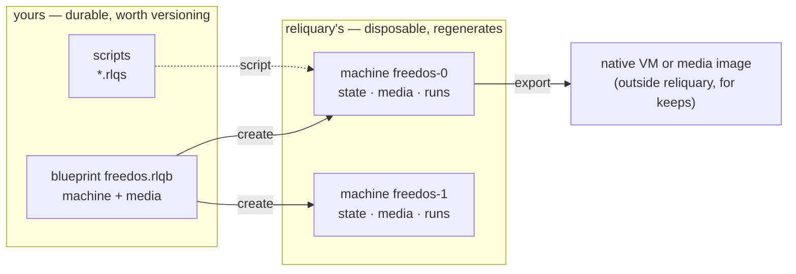
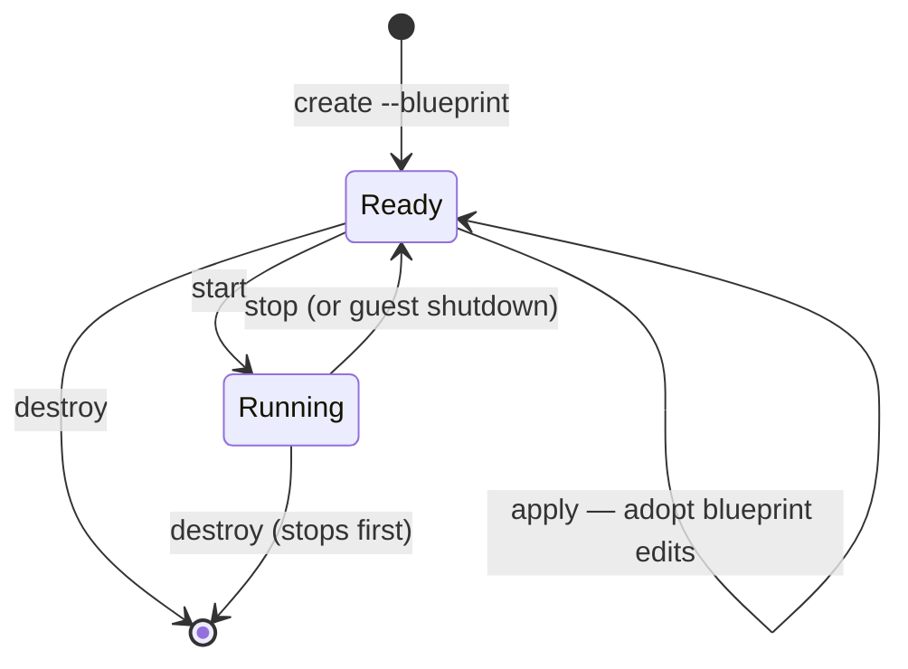

<!--
SPDX-FileCopyrightText: 2026 Paul Galbraith
SPDX-License-Identifier: GPL-3.0-only
-->

# Blueprint guide

> **Descriptive.** The authoritative definition of the format is the
> published schema (`src/reliquary/schemas/blueprint-schema-v1.json`,
> for structure) plus
> [the composed blueprint model](spec/blueprint-model.md) (for
> semantics). Where this guide disagrees with either one, this guide
> is wrong.

> **Status:** implemented, on top of the composed blueprint model. A
> machine's `drives` field names **media** components
> ([media spec](spec/media-spec.md)), resolved from the `.rlqb`
> namespace, with empty removable slots written as `null`. Along with
> `platform`, `memory`, `boot`, `description`, and `scripts`, this
> covers parsing, validation, media-name resolution, machine
> materialization, and persistent script-driven `insert`/`eject`. The
> remaining fields may still change before the first release; the
> composed model itself is worked out in
> [the composed blueprint model](spec/blueprint-model.md).

Every Reliquary machine starts from a reusable JSON **blueprint**,
and gets built as a separately identified **machine**. One blueprint
can create many machines. The blueprint is a single file holding an
array of **specs**: a `machine` and the `media` it uses. The detailed
ownership, state, locking, and recovery model is in
[Machine blueprints and machines](spec/instance-model.md).

## The model at a glance

A **blueprint** is a design you write and keep. A **machine** is a
disposable thing Reliquary builds from it — identified by a
generated id, cheap to destroy and rebuild, and never the actual
deliverable. When something you built should outlive the machine,
use `export` to take it out.



Each machine then moves through a small lifecycle, shown below. The
states are where a machine can sit at rest; every transition is an
explicit command — nothing tears a machine down, and nothing adopts
a blueprint edit, without you asking for it:



`recreate` is exactly `destroy` followed by `create`, run as one
command, keeping the same id. `clone` and `export` both act on a
Ready (stopped) machine. The table below shows what each verb
touches. The CLI command name is always the Python API function
name, dash-separated instead of underscored (the naming rule from
docs/spec/cli.md):

| verb       | blueprint file           | the machine (`cache/machines/<id>/`)   | CLI / API twin     |
|------------|--------------------------|----------------------------------------|--------------------|
| `create`   | reads                    | materializes, under a new id           | `create-machine` / `create_machine` |
| `start`    | —                        | runs (as its state describes)          | `start-machine` / `start_machine` |
| `stop`     | —                        | powers off                             | `stop-machine` / `stop_machine` |
| `apply`    | reads                    | reconciles to edits, new baseline      | `apply-blueprint` / `apply_blueprint` |
| `destroy`  | —                        | deletes entirely                       | `destroy-machine` / `destroy_machine` |
| `recreate` | reads                    | regenerates, same id                   | `recreate-machine` / `recreate_machine` |
| `clone`    | —                        | new machine, new id, drives copied     | `clone-machine` / `clone_machine` |
| `delete`   | deletes (refuses while machines exist) | —                        | `delete-blueprint` / `delete_blueprint` |
| `export`   | —                        | copies out                             | `export-drive` / `export_drive`; `export-machine` / `export_machine` |

Every verb is available on both the CLI and the embedding API
(planning/SURFACES.md): both call the same underlying functions,
which take plain arguments — a shape any binding language can
express — using the same selectors the CLI takes (a machine id, or
the blueprint name plus machine number, resolved by the shared
`resolve_machine()` function), plus the equivalent global keywords
(`home=`, `assets=`). What each call returns mirrors what the CLI
prints — `create_machine` returns the new machine id — and errors
raise a specific exception class where the CLI would exit with a
specific code. The mobility functions are named but not built yet
(see below): `clone_machine`, `export_drive`, `export_machine`, and
`import_vm` — the last one spelled that way because `import` on its
own is a reserved word in Python.

Two rules carry the whole model:

- **Editing the blueprint never changes an existing machine by
  itself.** A machine keeps the resolved snapshot it was created
  from (its *baseline*), and `apply` is the explicit step that
  adopts your edits into it. Between one `apply` and the next, the
  machine's own state is what's authoritative — normal operation
  (installer writes, a script's `insert`/`eject`) can legitimately
  make it diverge from the baseline, and `start` always runs the
  machine as its state actually describes it, never silently
  reverting anything.
- **Everything Reliquary materializes is disposable.** `destroy`
  followed by `recreate` rebuilds a machine completely from the
  blueprint — its machine spec, its media and archive components,
  and its scripts. Nothing under `cache/` is ever something you need
  to protect.

## The documents

```text
<reliquary_home>/blueprints/
└── msdos.rlqb               reusable blueprint — yours
<reliquary_home>/cache/machines/<id>/
├── machine.json             the machine's state — reliquary's; while
│                            running, the live VM identity folds in
│                            as a `vm` section
├── disks/                   per-machine materialized images, by
│                            media name
├── screenshots/             where the `screenshot` verb and an
│                            automatic failure capture land
└── <backend>/               the backend's own files (e.g. qemu/)
```

- The **blueprint** (`<name>.rlqb`) is the reusable machine shape
  you defined — the machine spec plus the media, source, and archive
  components it draws on, all in one file. It's yours: Reliquary
  reads it but never writes to it. `import` and the future `init`
  command write one for you, once, at your request, and never touch
  it again afterward; `delete` removes it, also only at your
  request.
- The **state** (`cache/machines/<id>/machine.json`) describes one
  machine: its identity, its blueprint, its lifecycle phase, and its
  resolved configuration. It sits at the root of the machine's own
  directory, which holds everything Reliquary has materialized for
  that machine: the state file, per-machine media images,
  screenshots, and backend files. The machine **is** this
  directory — nothing about a machine lives outside `cache/`,
  because a machine lives and dies as one unit. Reliquary writes all
  of it, and you never need to touch any of it yourself. **A script
  run stores nothing here.** It returns its output directly to
  whoever ran it — live progress as it goes, the final result at the
  end — so there's no record left in the machine's directory to read
  later or copy out.

This split reflects what Reliquary machines are actually for:
**ephemeral work**. A Reliquary machine is a disposable rig —
created to run a scripted OS install or an automated task, recreated
as often as you like, and deleted when you're done with it. The
blueprint is what makes rebuilding cheap: the entire cached
materialization is safe to throw away, because everything in it can
be regenerated from the blueprint (its media and archive components)
and its scripts. Nothing is exempt from this — a script run leaves
no record here that could be lost. The machine itself is never the
product — **the result is** (U14). The point of running a machine is
to run some tests or a script, and what you get back is whatever the
run returned, plus any file you asked Reliquary to hand over — both
of those are already yours by the time the machine becomes disposable
again ([see the run's output](spec/script-spec.md#the-runs-output-and-failure)).
When what you built is bigger than that, `export` it: either as a
media image (a disk image taken out of the machine) or as the entire
machine, handed off to a hypervisor built for keeping machines
around long-term. Reliquary itself is not the place to keep a
machine you care about.

That same split runs through the whole Reliquary home: everything
outside `cache/` is durable data that belongs to you. Blueprints —
each carrying its own media and archive components — and scripts
are small, shareable, and worth putting in version control. The
[user properties file](spec/script-properties.md) is also durable,
but personal, and normally isn't shared or committed. Everything
under `cache/` belongs to Reliquary: it's disposable and can always
be reconstructed, without exception — a run never leaves anything
there that a rebuild couldn't reproduce. There's no way to drop
pre-made files directly into a cache directory; content only enters
a machine through the blueprint — a drive names a
[`media`](blueprint-reference.md#drives) component, and that media
component controls how it's materialized (a fresh blank disk, a
writable overlay on top of a payload, a copy of one, or an attached
payload as-is).

This page explains the format, and how these documents behave over
a machine's life. Related pages:

- **[Field reference](blueprint-reference.md)** — every field,
  every rule.
- **[Cookbook](blueprint-cookbook.md)** — complete worked
  examples.
- **[The composed blueprint model](spec/blueprint-model.md)** — the
  format's **authoritative definition**: the root document shape,
  spec identity and naming rules, the location grammar, containment,
  and the closed set of references allowed. This guide teaches you
  the format; that document is what defines it precisely.
- **[The media spec](spec/media-spec.md)** — how media payloads are
  fetched, verified, cached, and cleaned up.
- **[Script properties](spec/script-properties.md)** — how scripts
  read values: the order sources are checked in, and the user file
  that holds reusable personal values and protected secrets.

## What the blueprint format is

**It doesn't depend on any particular backend.** The same blueprint
can describe a machine on any supported virtualization backend —
QEMU, VirtualBox, VMware Workstation, or Hyper-V. Nothing in the
core format is secretly a QEMU option or a VirtualBox setting. The
one deliberate exception is the
[`backend-settings`](blueprint-reference.md#backend-settings) field,
an explicitly scoped escape hatch for backend-specific settings. A
blueprint that doesn't use it is portable automatically — the same
checked-in blueprint works on every developer's machine (U4).

**A blueprint and a machine's state are two different formats.** The
blueprint is the portable JSON document you write. The machine
state, which Reliquary owns, wraps the blueprint's resolved form
with identity, lifecycle, and backend information. See
[the instance model](spec/instance-model.md).

**Machine specs have names; machines have ids.** A machine spec must
declare its own `name` field — the `.rlqb` file's filename is never
used as an identity. `--blueprint <name>` selects the machine spec
with that name; the resulting machine's id is `<name>-<n>`. Commands
take `--machine <name>-<n>` as the full, exact id, or just
`--blueprint <name>` when exactly one machine of that blueprint
exists. `destroy` frees the number for reuse on the next `create`.
Selecting by name only matches machines from *this* invocation's
resolution: a machine only matches if the name resolves — through
the asset root — to the same blueprint file that machine
[records](blueprint-reference.md#blueprint-source) as its own. So
two projects that both happen to have a blueprint with the same name
never select each other's machines.

## A first example

A minimal blueprint that boots a DOS floppy image:

```json
{
  "type": "machine",
  "name": "msdos622",
  "platform": "dos",
  "drives": {
    "floppy": "msdos622-boot"
  }
}
```

This is a **lone spec object** — shorthand for an array containing
just one spec. It has to declare `"type": "machine"` explicitly,
because `type` defaults to `media` everywhere else. The `floppy`
drive names a media, `msdos622-boot`, which Reliquary resolves from
the catalog: either a media spec in a sibling `.rlqb` file, or a
codex media that gets seeded the first time it's referenced. To ship
the machine and its media together as one self-contained file, write
it as an array instead —
`[ { "type": "machine", … }, { "type": "media", … } ]` (see
[the media spec](spec/media-spec.md) and
[cookbook](blueprint-cookbook.md)).

Save it as `msdos.rlqb` anywhere under your asset root — the current
directory by default, or the Reliquary home if you're keeping a
shared personal collection. A `blueprints/` subdirectory is purely
optional organization (docs/spec/asset-resolution.md). Blueprints
can arrive several ways: written by hand, seeded from the
[codex](spec/codex.md) (automatically, the first time one is
referenced), synthesized from a native VM by `import`, or scaffolded
by the future `init` command. Seeding is always an explicit act —
`rlq seed-blueprint <name>`, a CLI command with no API equivalent —
because the codex is never silently consulted as a fallback
(ARCHITECTURE.md P4, P18). That's true whether you're at the
keyboard or running automation: point `--blueprints-dir` at your
project (where it becomes the only source Reliquary reads from),
seed a copy once, and commit it. Create a machine and run it:

```powershell
rlq create-machine --blueprint msdos
rlq start-machine --blueprint msdos --display
rlq stop-machine --blueprint msdos
```

`create-machine` resolves the blueprint against an assigned backend,
materializes the machine under a cache directory named for its id,
and prints the new id. With only one machine of that blueprint,
`--blueprint msdos` selects it everywhere it's needed;
`--machine msdos-0` (or `--blueprint msdos --machine 0`) always
works too, and becomes required once a blueprint has more than one
machine.

## Blueprint and state

### The blueprint — yours

A `.rlqb` file holds the machine shape exactly as you defined it —
the file you wrote, and whatever you edit it to later. Write as
little as possible, and let resolution fill in the rest:

- Omit `backend` and Reliquary picks the best available one.
- Omit `memory`, `cpus`, or `control-planes` and the platform's
  defaults apply.
- Use shorthand: `"hdd"` instead of `"hdd0"`, a bare media-name
  string instead of an object.

Omitting a field isn't the same as baking in its current default
value: a blueprint that omits `memory` keeps tracking whatever the
platform default is, even if that default changes in a later
version of Reliquary.

A blueprint isn't allowed to contain
[state-only fields](blueprint-reference.md#state-only-fields) —
`create-machine` rejects a document that has any.

**Editing the blueprint is how you're meant to reconfigure a
machine — but only through the explicit `apply` step.** A machine
created from a blueprint keeps the *resolved snapshot* of that
blueprint as its baseline. Editing the blueprint file only changes
what a future `create-machine` will build — it doesn't touch
machines that already exist. To bring blueprint edits into an
existing machine, stop it and run
[`apply`](#applying-blueprint-edits). Nothing is ever adopted
automatically when you `start` a machine.

### The state — Reliquary's

`cache/machines/<id>/machine.json` describes the machine as it
actually is, and Reliquary is the one that keeps it up to date:
whenever Reliquary changes the machine — inserting media, changing
memory, reordering boot devices — it updates the state file as part
of that same operation. If a state document ever disagrees with the
hypervisor's actual configuration, that's a bug in Reliquary, not
something you need to sort out yourself. While the machine is
running, the state also carries a `vm` section holding the live VM's
identity and connection port, written atomically together with the
lifecycle `phase` field, and cleared once the machine stops.

Nothing in the state is left implicit:

- shorthand keys and values are spelled out in full (`"hdd"`
  becomes `"hdd0"`, a bare media name becomes a `media` object);
- platform defaults are written in as explicit values;
- the assigned `backend` is recorded, along with fields that only
  exist in the state: the machine's own `id` (repeated in the file
  as a safety check, in case a machine directory ever gets
  misplaced or hand-copied), `backend-id`, the resolved blueprint's
  digest, and the blueprint's resolved source path — plus
  bookkeeping fields like the blueprint's name, the creation time,
  and the lifecycle phase. (A script's outcome is whatever it
  returned to whoever ran it — there's no `installed` flag, and
  nothing about a run is stored here.)

The blueprint from the [first example](#a-first-example)
produces, on a host where QEMU was selected:

```json
{
  "id": "msdos-0",
  "blueprint": "msdos",
  "created": "2026-07-19T18:20:11Z",
  "phase": "ready",
  "platform": "dos",
  "backend": "qemu",
  "backend-id": "reliquary-msdos-0",
  "memory": 16,
  "cpus": 1,
  "drives": {
    "floppy0": {
      "medium": "floppy",
      "slot": 0,
      "media": "msdos622-boot",
      "materialize": "use",
      "path": "<cache>/media/msdos622-boot.img"
    }
  },
  "boot": ["floppy0"],
  "control-planes": ["agentless-display"]
}
```

Each resolved drive records its `medium` and `slot`, the `media` it
names, how that media `materialize`s, and the actual cache `path` it
materialized to. A running machine also carries a top-level `vm`
section.

Don't edit the state file — or anything else under
`cache/machines/<id>/`. Reliquary rewrites the state as it operates
the machine, and reconciliation regenerates the backend's
configuration from the state, so any hand edit gets silently
overwritten. There's never a reason to edit it directly: the
blueprint is your interface for changing anything.

Reliquary rewrites the state carefully: as part of the same
operation that changed the machine, atomically (writing to a
temporary file and replacing the original), and in a consistent
format — strict JSON, a stable key order, two-space indentation,
UTF-8, and a trailing newline.

### Reconciliation at `start`

Every `start-machine` brings the machine's state and the actual
backend back in line with each other. It's the state document — not
the baseline — that determines how the machine runs; the baseline
only comes into play through `create` and `apply`:

1. The machine's state is loaded and checked against the resolved
   baseline's *shape* — its drive slots, hardware, and capabilities —
   without reverting any content that has since diverged from that
   baseline. The blueprint file itself isn't re-read here; picking
   up blueprint edits is `apply`'s job, not `start`'s.
2. Every media the state references — including media that a
   script attached — is resolved from the blueprint namespace and
   hash-verified, fetching it if it's missing or stale (see
   [the media spec](spec/media-spec.md)). The machine never boots
   against media that changed without anyone noticing.
3. The state is compared against the actual backend machine (after
   verifying its identity — see
   [backend assignment](#backend-assignment)), and any difference
   Reliquary can apply is applied — the backend's configuration is
   regenerated to match the state.
4. Anything Reliquary can't reconcile — an unrecognized
   `backend-id`, a missing image file, a capability the backend
   doesn't have — stops the start with an error naming both sides of
   the mismatch. Nothing is ever silently adopted from either side.

### Applying blueprint edits

```powershell
rlq apply-blueprint --blueprint msdos
```

`apply-blueprint` brings the current blueprint into an existing,
stopped machine: it re-validates and re-resolves the blueprint,
reconciles the machine to that new resolution, and records the new
digest as the machine's baseline. Because it reconciles the machine
*to match the blueprint*, `apply` is also how you fix a machine that
has drifted — for example, an interrupted install script that left
its installer CD attached — back to its blueprint shape. Differences
the machine can absorb without rebuilding anything — memory, boot
order, drives enabled or disabled, changed `media` references, added
drives — are applied directly. Differences it can't absorb — a
changed `size` on an already-materialized `new` image, or a change
to how an already-built media `materialize`s — cause `apply` to
refuse, naming both the blueprint's value and the machine's current
one; `recreate` is the option to reach for when the drives genuinely
need to be rebuilt.

### Runtime changes live in the state

Script steps and CLI commands that reconfigure a machine — inserting
installer media, ejecting a CD — update the state (and the actual
machine), never the blueprint. The blueprint stays a record of what
you meant the machine to be; the state absorbs whatever's actually
been done to it, and keeps that. An inserted medium persists across
`stop`/`start` exactly the way an installer's disk writes do — the
machine has genuinely diverged from its blueprint, and stays
diverged until something changes it back. The usual pattern for
temporary media is symmetry inside the script: the install script
inserts its installer CD as its first step and ejects it as its last,
leaving the machine back in its default shape. A machine that's been
left diverged — whether by an interrupted script, or on purpose — is
brought back to its blueprint shape with `apply`.

To make a change stick across future `apply` runs, make the change
in the blueprint itself, not just on a running machine.

### Destroying and recreating a machine

Because the blueprint lives outside the cache, a machine is always
disposable:

```powershell
rlq destroy-machine --blueprint msdos
rlq recreate-machine --blueprint msdos
```

`destroy-machine` deletes the machine entirely — its whole directory
(state, drive images, screenshots) and the backend's own machine
object, stopping it first if it's running — and never touches the
blueprint. `create-machine` makes a fresh machine from the blueprint
whenever you want one again. `recreate-machine` is exactly `destroy`
followed by `create`, run as one command, reusing the same id.
Drives regenerate the way their media declares: a `new` media comes
back blank, a [`difference` or `copy` media](spec/media-spec.md#materialize)
comes back as a fresh overlay on (or copy of) its payload. An
installed system that only exists in the cached drive image is gone
after `recreate` — that's the whole point of it. If it should
survive, `export` it first, or generate it with an install script
you can just run again.

Because resolution runs from scratch again, backend assignment does
too: a blueprint that doesn't pin `backend` might come back on a
different backend than before. This is the intended way to move a
machine to a different backend — and since the drive images
regenerate as well, they come back in the new backend's own native
format.

### Cloning, exporting, importing — unbuilt

> None of these three commands ships today. Their names and
> behavior are settled, and the design below stands as written, but
> there is no `clone-machine`, `export-drive`, `export-machine`, or
> `import-vm` command, and no Python equivalent for any of them.
> They're tracked as Machine mobility in
> planning/proposed/FEATURES.md, taken off the numbered roadmap
> since 2026-07-23 for lack of a concrete use case. The authoritative
> CLI spec ([spec/cli.md](spec/cli.md)) only describes what actually
> exists, so it doesn't cover these — read this section as a design
> sketch, not as instructions you can follow today.

Three more lifecycle commands would follow from the same model
(machine stopped, in every case):

**`clone`** would duplicate a machine as a new machine under a new
id (printed the way `create`'s is). The clone would keep the
source's resolved blueprint snapshot as its own baseline, and the
source's writable drive images (if they've been materialized) would
be copied into the clone's cache — a snapshot of a machine, not
another blueprint. The clone would get its own backend object and
`backend-id`; the state and backend registration itself would never
be copied.

**`export`** would take something durable out of an ephemeral
machine, as two separate commands (decided by the owner,
2026-07-22). `export-drive <key> <destination>` would take a single
drive out as a standalone image file, in the drive's native format
or raw, depending on the destination's file extension.
`export-machine --to <exporter>` would create and register a native
VM with a management platform built for keeping machines around —
the target names an **exporter** (virtualbox, vmware, hyperv,
libvirt — a set of names probed on the host, and deliberately kept
separate from the backend list). This target would be shown as a
prompt on an interactive terminal, and required as a flag when run
non-interactively — never picked automatically. The native VM would
be built from the machine's resolved blueprint shape, with drives
converted through the adapters' raw interchange format, and media
payloads copied in so the exported VM stands entirely on its own.
This is the intended long-term answer to the fact that Reliquary
machines are ephemeral: when something should live on, you export
it (U8). An exported machine would be independent and permanently
outside Reliquary's control — Reliquary would never touch it again.

**`import <source> --platform <platform>`** would go the other way:
it would produce a *blueprint* from a native backend VM — a composed
`.rlqb` synthesized from the backend's machine configuration, with
the VM's disks captured as `media` components right where they are.
Each would get a `media` entry whose
[`source`](spec/media-spec.md#locators) is a `local` locator pointing
at the disk file where the native hypervisor keeps it, plus a
computed `sha256` hash and no URL — and the machine's drives would
name those media. Import would only read a source that's at rest: a
source VM that's running — or suspended, where the disks are stable
but full of mid-flight guest state — would fail, naming the VM and
its current state; you'd need to power it off first. The captured
disk images would never be copied, moved, or modified; the media
component belongs to you, so if an image needs to live somewhere
more durable, you'd move it yourself and update its `local` source
to point at the new location. Import would present two choices,
neither with a default (U2) — on an interactive terminal, leaving a
flag out would prompt you and explain the tradeoff; run
non-interactively, leaving it out would be an error:

- `--snapshot` / `--no-snapshot` — whether the native hypervisor
  should snapshot the disks first. This is the one thing import
  would be allowed to do to the source VM, and only with this
  explicit consent. Snapshotting would pin the captured definitions
  to a frozen point in time, while the source VM stays free to keep
  running natively. The snapshot would be named by Reliquary,
  recorded in the generated media components' `notes`, and would
  then be yours to manage in your native tooling (if it's ever
  deleted, verification would report the missing content).
  `--no-snapshot` would leave the source VM untouched — but running
  the source VM again afterward would rewrite its disks, and
  verification would then refuse to resolve the media until you
  re-import.
- `--hdd-images (duplicate | difference)` — how machines would
  materialize from the captured disks, written explicitly into each
  generated media's [`materialize`](spec/media-spec.md#materialize)
  setting (`duplicate` becomes `copy`, `difference` stays
  `difference`). `copy` would duplicate the image into each created
  machine, so its drive stands entirely on its own afterward.
  `difference` would give the cheapest possible create, but it
  keeps depending on the original source staying byte-for-byte
  identical — media verification at `start` would refuse a machine
  whose source has since been rewritten.

Import would stop at producing the blueprint — it would never create
a machine itself; you'd run `create-machine` for that. A machine
created from an imported blueprint would recreate like any other
machine: from its media. Translating backend configuration — memory,
drives, controllers — is straightforward; guessing what OS is
actually installed is not, and no backend records that information,
which is why `--platform` would be required. The intended use is
running scripted, disposable experiments against a copy of a real
machine, without risking the original (U2). The Python equivalent
would be `import_vm` (`import` on its own is a reserved word in
Python), with `blueprint`, `platform`, `hdd_images`, and `snapshot`
parameters mirroring the flags.

`delete-blueprint` takes only `--blueprint`: it removes the
blueprint file itself, and refuses to run while any machine created
from it still exists, naming those machine ids in the error —
`destroy` them first. (Removing a machine is `destroy`'s job. With
`delete`, `--blueprint` always names the blueprint you want removed,
never a machine.)

## Backend assignment

`backend` is optional in a blueprint. When it's left out,
`create-machine` walks through Reliquary's internal backend priority
order and assigns the first backend that is:

1. **available** — actually installed and working on this host
   (backends are detected automatically), and
2. **capable** — able to provide everything the blueprint asks
   for (its media, controllers, image formats, control planes).

**A `backend-settings` section for just one backend narrows this
down automatically.** If a blueprint has settings for exactly one
backend, that already tells Reliquary which backend it's written
for, so assignment goes straight there instead of walking through
the priority order — and fails if that backend turns out to be
unavailable or incapable, saying explicitly that the
`backend-settings` section is what narrowed the choice. Settings
sections for two or more backends don't narrow anything — each one
just stays unused until its backend happens to win the ordinary
walk. Either way, an explicit `backend` field always takes priority
over `backend-settings`.

The assignment is recorded in the machine's state, not the
blueprint, so the blueprint itself stays portable. And it holds for
the machine's entire life: backend disk formats, identifiers, and VM
registration don't carry over between hypervisors, so the assignment
never silently changes under a running machine. To move a machine to
a different backend, [recreate it](#destroying-and-recreating-a-machine).

Declaring `backend` explicitly pins the choice — `create-machine`
fails if that specific backend is unavailable or incapable, rather
than silently falling back to a different one.

Along with the assignment, the state records `backend-id` — the
backend's own identifier for the machine. Reliquary never sends a
control command to a hypervisor object without first checking that
its identity matches the recorded `backend-id`, so a stale or
unrelated machine object gets detected and refused, rather than
accidentally controlled.

## Customization seams

A blueprint is meant to be seeded and then customized (U5): find the
standard blueprint, copy it, change the obvious thing, and run it.
The places built into a blueprint where you're expected to make that
kind of change are called **seams**, and its author designs them in
deliberately. There are two kinds.

**A value seam** carries a piece of data into the blueprint's
scripts: a user name, a license key, which supplemental disk to use.
The [`parameters` field](blueprint-reference.md#parameters) supplies
a value for each [property a script declares](spec/script-spec.md#properties),
by key. It can either set the value directly in the blueprint, or
point at a [user property](spec/script-properties.md) that each user
defines locally on their own machine — so, for example, a license
key can be read when the script runs, without ever being checked
into version control.

**A composition seam** changes what the guest itself actually shows.
Installing the German edition of Windows means German vendor media
and German installer screens — different text for the script to
watch for, and that's not something a single value can parameterize:
script properties are deliberately never allowed to affect what a
script's `wait` conditions look for, so the script's structure stays
fixed no matter what values are plugged in. Switching editions has
to happen by composition instead, and the blueprint already has both
of the pieces you'd swap: its
[`drives`](blueprint-reference.md#drives) media references name the
vendor media, and its [`scripts`](blueprint-reference.md#scripts) map
names the scripts that drive the install. A customized blueprint
points both at a different, localized pair, since each script only
works against the specific installer it was written for.

## Validation: fail closed, name the problem

Reliquary never guesses at what a blueprint means, and never
silently degrades what you asked for. Two kinds of checks apply:

**Format checks** reject a malformed document outright: unknown
fields, bad values, clashing drive slots, state-only fields showing
up in a blueprint. See the [field reference](blueprint-reference.md)
for each field's exact rules.

**Capability checks** compare the blueprint against what the
machine's actual backend can do. A blueprint can be perfectly
well-formed and still ask for something its backend can't provide —
a differencing disk in a format that doesn't support differencing, a
SCSI controller on a backend generation that doesn't have one, VNC
on Hyper-V. These fail with a *capability error* naming both the
backend and the capability it's missing, at `create`, `apply`, or
`start` — Reliquary never silently drops the feature or fakes it.

The format checks also have a machine-readable companion: a
published JSON Schema
([blueprint-schema-v1.json](../src/reliquary/schemas/blueprint-schema-v1.json))
— one schema covering the whole composed document, including the
machine, media, source, and archive components. It captures each
document's structural rules, so editors can offer autocomplete and
validation while you're writing a blueprint (U4, U5). It's published
under `src/reliquary/schemas/` and versioned as v1, so editors can
bind to it today; it'll keep evolving as v1, adding to itself where
it can without breaking anything. The written field reference stays
the authoritative source, and passing schema validation never means
a blueprint is actually valid — resolving media names, cross-document
rules, and every capability check all happen beyond what the schema
can express. The schema only validates the parsed document, so JSON5
comments and other syntax extensions are invisible to it; editors
bind it to `.rlqb` files by file association.

## Platform defaults

Omitted blueprint fields resolve from the guest platform, and
the resolved values appear in the state:

| platform | memory (MiB) | cpus | control-planes            |
|----------|--------------|------|---------------------------|
| `dos`    | 16           | 1    | `["agentless-display"]`   |
| `openbsd` | 512         | 1    | `["agentless-display"]`   |
| `win9x`  | 64           | 1    | `["agentless-display"]`   |
| `winnt`  | 256          | 1    | `["agentless-display"]`   |

## Format stability

The format's stability guarantees, its JSON5 grammar, the closed
`${…}` reference grammar, and the rule for how the format is allowed
to grow are all part of the authoritative spec, not this guide: see
[blueprint-model.md](spec/blueprint-model.md), "Format stability".
The short version: no backward compatibility is promised before 1.0
(P9); there's no `version` or `$schema` field; you write JSON5, and
Reliquary writes back strict JSON; values can gain more detail over
time, but computed expressions never enter the document tree; and
the `${...}` reference syntax is closed to operators — it can only
reference a value, never compute with one.

## Where to next

- [Field reference](blueprint-reference.md) — `platform`,
  `backend`, `drives` (naming media components),
  `boot`, `control-planes`, `parameters`, `backend-settings`, and
  the state-only fields, with every rule and per-field examples.
- [Cookbook](blueprint-cookbook.md) — complete blueprints for
  common machine shapes, with the state documents they resolve
  into.
