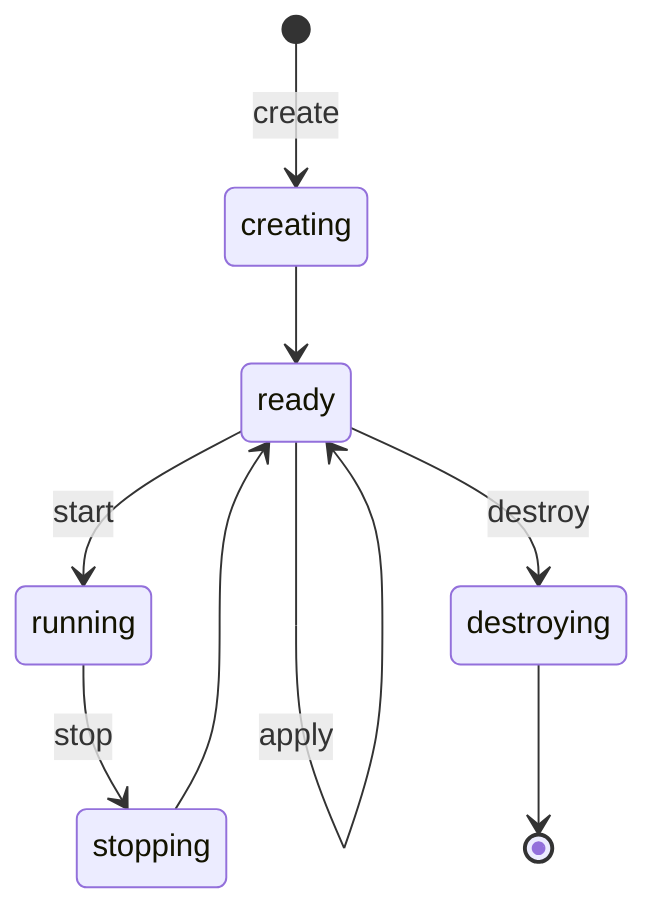

<!--
SPDX-FileCopyrightText: 2026 Paul Galbraith
SPDX-License-Identifier: BSD-3-Clause
-->

# Machine blueprints and machines

> **Status:** this documents the planned machine model. It replaces
> the earlier one-declaration/one-machine model and is not implemented
> yet.

A **blueprint** is a reusable, user-owned JSON description of a kind of
machine. A **machine** is one realization of that blueprint: its
writable disks, backend object, run history, and lifecycle. One blueprint
may have zero, one, or many machines. Blueprints have names; machines
have ids.

```text
<reliquary_home>/
├── blueprints/
│   └── freedos-plain.json          user-owned reusable blueprint
└── cache/machines/
    └── 5fd11917…/                  the machine — disposable
        ├── reliquary-machine.json
        ├── drives/
        ├── runs/
        └── backend files and logs
```

The file name of `blueprints/<name>.json` is the blueprint name. A machine's
identity is a generated UUID; the cache directory, locks, run
directories, and backend identity all use it, and there is no
separate machine name. A machine **is** its cache directory —
nothing about a machine lives outside `cache/`, because nothing
about a machine is durable. Deleting the cache deletes the
machines, by design.

Commands select their targets with explicit flags, never
positionally. `--machine <id>` accepts the full UUID or any
unambiguous prefix, git-style; listings print a short prefix for
this use. On machine-level verbs, `--blueprint <name>` selects that
blueprint's machine when exactly one exists — the common
one-machine-per-blueprint case — and otherwise fails, listing the
candidate ids (or, with no machine, suggesting `create`;
`script` creates one instead).

## Lifecycle

A machine rests in one of two phases — `ready` or `running` — and
passes through transitional phases (`creating`, `stopping`,
`destroying`) that exist so an interrupted operation is
detectable and recoverable:



`destroy` removes the machine entirely — there is no
half-destroyed resting phase, because a machine is nothing but
its cache directory. `recreate` is `destroy` + `create` as one
command, reusing the same id; `clone` and `export` require
`ready`. On startup reliquary detects a machine stranded in a
transitional phase and completes a safe rollback or fails with
recovery instructions (see below).

```text
reliquary list blueprints
reliquary list machines [--blueprint <name>]
reliquary create --blueprint <name>
reliquary start (--machine <id> | --blueprint <name>) [--display]
reliquary stop (--machine <id> | --blueprint <name>)
reliquary apply (--machine <id> | --blueprint <name>)
reliquary destroy (--machine <id> | --blueprint <name>)
reliquary recreate (--machine <id> | --blueprint <name>)
reliquary delete --blueprint <name>
reliquary clone (--machine <id> | --blueprint <name>)
reliquary export (--machine <id> | --blueprint <name>) [<destination>]
```

`list blueprints` shows each blueprint and its machine count; `list machines`
shows each machine's short id, blueprint, phase, and backend —
both enumerated by scanning `cache/machines/`. `create`
validates and resolves the current blueprint, materializes a new
machine under a new UUID — state, writable drives, backend
object — and prints the id. `destroy` deletes the machine
entirely: the whole cache directory and the backend machine.
`recreate` is `destroy` followed by `create` as one command,
reusing the same id. `delete` takes only `--blueprint`: it
removes the blueprint file itself and fails closed while any
machine of it exists, naming the machine ids — destroy them
first.

Editing a blueprint affects future `create` operations, not existing
machines. Each machine records the source blueprint and resolved digest at
creation; that resolved snapshot is the machine's baseline, and
`start` reconciles the machine against it, not against the current
blueprint file. Adopting blueprint edits is the explicit `apply`: with the
machine stopped, it re-resolves the current blueprint and reconciles the
machine to it — applicable differences (memory, boot order, drives
enabled or disabled, media changes) are applied and the recorded
digest updated; contradictions the machine cannot absorb without
regenerating (such as a changed `size` on an existing image) fail
closed naming both sides, leaving `recreate` as the honest
alternative. Applying a newer blueprint never happens implicitly at
`start`.

`clone` creates a new machine under a new UUID. It retains the same
resolved blueprint snapshot but copies the source machine's writable drives
when they exist; it is therefore a snapshot of a machine, not another
name for a blueprint. A future `fork-blueprint` command may create a new editable blueprint; it
is intentionally not implicit in clone.

## The machine state

The blueprint remains the plain machine JSON object described by the
[machine blueprint](machine-blueprint.md). The machine's one document is
`cache/machines/<id>/reliquary-machine.json` — the resolved
blueprint fields plus the machine's own bookkeeping, not a second
spelling of the blueprint schema:

```json
{
  "id": "5fd11917-147a-4b6b-b7f6-9f4b6d7d1ab2",
  "blueprint": "freedos-plain",
  "created": "2026-07-19T18:20:11Z",
  "phase": "ready",
  "...": "resolved blueprint fields, backend-id, blueprint-digest"
}
```

It contains the machine's own id (repeated inside the file as a
safety check — it must match the directory it sits in, so a
hand-copied or misplaced machine directory fails closed), the
source blueprint name, creation time, lifecycle phase, operation
generation, the resolved blueprint digest, backend ID, realized
drive/controller addresses, and transient runtime attachments. It
must never be edited by hand.

The phase is one of `creating`, `ready`, `running`, `stopping`,
or `destroying`. Every mutating operation takes an exclusive
per-machine lock before inspecting backend state. On startup
reliquary detects an interrupted phase, verifies backend
identity, and either completes a safe rollback or fails with
explicit recovery instructions. Atomic file replacement protects
JSON writes; it does not pretend a host file write and a
hypervisor operation are one transaction.

There is no `installed` boolean. Script outcomes belong to the
append-only run records under the instance cache, where they can name
the script, its source digest, result, transcript, and produced
artifacts without making a vague claim about the guest's contents.

## Naming and identity

Users author and rename blueprints by changing files in `blueprints/`.
Machines are never renamed because they have nothing to rename:
the UUID is the whole identity, fixed at `create` and carried
through `recreate`. Manual renames of machine
directories under `cache/machines/` are unsupported.

## JSON remains the format

Blueprints, machine state, and media definitions remain
JSON. They are declarative documents with strict schemas and benefit
from editor completion, stable formatting, and precise diagnostics.
The script language remains the separate line-oriented behavioral
format. Reliquary publishes a JSON Schema for each JSON document type;
the schema version tracks the reliquary release, not a version field in
user documents before beta.
