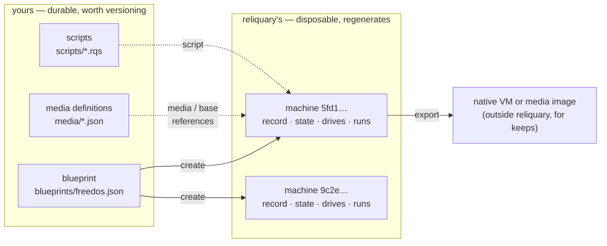
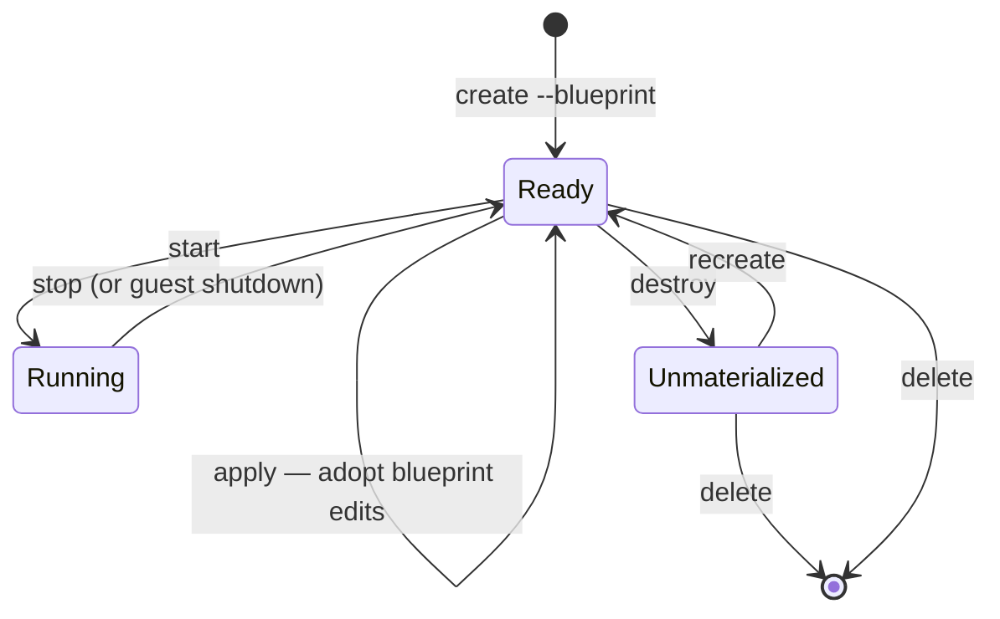

<!--
SPDX-FileCopyrightText: 2026 Paul Galbraith
SPDX-License-Identifier: BSD-3-Clause
-->

# The machine blueprint

> **Status:** this documents the planned machine blueprint format. The
> machine model is not implemented yet; details may still change
> before first release.

Every reliquary machine begins with a reusable JSON **blueprint** and is
realized as separately identified **machines**. One blueprint can create
many machines. The detailed ownership, state, locking, and recovery
model is in [Machine blueprints and machines](instance-model.md).

## The model at a glance

A **blueprint** is a design you author and keep. A **machine** is
a disposable realization reliquary builds from it — identified by
a generated id, cheap to destroy and rebuild, never the product.
When a result should outlive its machine, `export` carries it out.



Each machine then moves through a small lifecycle. Solid states
are where a machine rests; every verb is explicit, and nothing
tears a machine down or adopts a blueprint edit implicitly:



`recreate` also works from Ready (it is exactly `destroy` +
`create` under the same id), and `clone` and `export` act on a
Ready (stopped) machine. What each verb touches:

| verb       | blueprint file | machine record | materialization       |
|------------|----------------|----------------|-----------------------|
| `create`   | reads          | creates        | creates               |
| `start`    | —              | reads          | runs (reconciles to baseline) |
| `stop`     | —              | reads          | powers off            |
| `apply`    | reads          | updates digest | reconciles to edits   |
| `destroy`  | —              | keeps          | deletes               |
| `recreate` | reads          | keeps (same id)| regenerates           |
| `clone`    | —              | new record, new id | copies drives     |
| `delete`   | `--blueprint`: deletes | `--machine`: deletes | deletes  |
| `export`   | —              | reads          | copies out            |

Two rules carry the whole model:

- **Editing the blueprint never changes an existing machine by
  itself.** A machine keeps the resolved snapshot it was created
  from (its *baseline*); `apply` is the explicit step that adopts
  your edits, and `start` reconciles against the baseline only.
- **Everything reliquary materialized is disposable.** `destroy` +
  `recreate` rebuilds a machine wholesale from the blueprint,
  media definitions, and scripts; nothing under `cache/` is ever
  precious.

## The documents

```text
<reliquary_home>/blueprints/
└── msdos.json               reusable blueprint — yours
<reliquary_home>/machines/
└── 5fd11917….json           durable machine record — reliquary's
<reliquary_home>/cache/machines/<id>/
├── state.json               resolved state — reliquary's
├── drives/                  the machine's disk and floppy images
├── screenshots/             captured screens (transient)
└── ...                      backend files and logs
```

- The **blueprint** (`blueprints/<name>.json`) is the reusable machine shape
  you defined. You own it: reliquary reads it and never writes it.
- The **machine record** (`machines/<id>.json`) identifies one
  realization of a blueprint. The generated UUID in its file name is
  the machine's identity and locates its cache.
- The **state** (`cache/machines/<id>/state.json`) describes the
  resolved configuration and lifecycle of that machine, at the root
  of its **cached materialization** — the directory holding
  everything reliquary materialized for the machine: state, disk
  images, screenshots, backend files. reliquary owns all of it;
  you never need to touch it. Screenshots in particular are
  transient diagnostics with no retention promise — copy out any
  capture you want to keep, promptly.

The split reflects what reliquary machines are for: **ephemeral
work**. A reliquary machine is a disposable rig — created to run a
scripted OS install or an automated task, recreated freely, and
deleted when done. The blueprint makes rebuilding cheap; the
entire cached materialization is safe to throw away, because
everything in it regenerates from blueprints, media definitions,
and scripts. The machine is never the product — often nothing
durable comes out at all (the point was to run some tests); when
there is interest in something more durable, `export` it — either
a media image (a disk image taken out of the machine) or the
entire machine, handed to a hypervisor built for long-lived
machines. reliquary is not the place to keep a machine you care
about.

The same ownership line runs through the whole reliquary home:
everything outside `cache/` is durable data you own. Machine
blueprints, media definitions, and scripts are small, shareable,
and worth versioning. The [user property registry](property-registry.md)
is also durable but personal and normally not shared or committed. A
media definition may initially be installed from an embedded script
block, after which its library copy is likewise user-owned. Everything
under `cache/` is reliquary's and reconstructible. There is no dropping
of pre-created files into cache directories; inputs enter machines
through the blueprint —
[`media` references](machine-blueprint-reference.md#media--optional--string)
and [starting-point
images](machine-blueprint-reference.md#base--optional--string-or-object)
that machine drives are differenced from, or copies of.

This page explains the format and how these documents behave
through a machine's life. Companion pages:

- **[Field reference](machine-blueprint-reference.md)** — every field,
  every rule.
- **[Cookbook](machine-blueprint-cookbook.md)** — complete worked
  examples.
- **[The media spec](media-spec.md)** — the media library, including
  definitions that scripts can install before machine resolution.
- **[The user property registry](property-registry.md)** — reusable
  personal values and protected secrets bound to script inputs.

## What the blueprint format is

**It is backend-agnostic.** The same blueprint can describe a
machine on any supported virtualization backend — QEMU,
VirtualBox, VMware Workstation, or Hyper-V. Nothing in the core
format is a QEMU option or a VirtualBox setting in disguise. The
one deliberate exception is the
[`backend-settings`](machine-blueprint-reference.md#backend-settings)
field, an explicitly scoped escape hatch; a blueprint that
doesn't use it is portable by construction.

**A blueprint and its state are not the same format.** The blueprint is the
portable JSON document you author. The reliquary-owned machine
record and cache state wrap its resolved form with identity,
lifecycle, and backend facts. See
[the instance model](instance-model.md).

**Blueprints have names; machines have ids.** A blueprint's name is its file
name. A machine's identity is its generated UUID — commands take
`--machine <id>` with the full id or any unambiguous prefix,
git-style, and `--blueprint <name>` selects a blueprint's machine when
exactly one exists. Machines are never renamed; the id is the
whole identity.

## A first example

A minimal blueprint that boots a DOS floppy image:

```json
{
  "platform": "dos",
  "drives": {
    "floppy": "msdos622-boot"
  }
}
```

Save it as `blueprints/msdos.json` — blueprints are authored directly into
`blueprints/`, by hand, by the future `init` scaffolding command, or by
`import` — then create a machine from it and run it:

```powershell
reliquary create --blueprint msdos
reliquary start --blueprint msdos --display
reliquary stop --blueprint msdos
```

`create` resolves the blueprint against an assigned backend,
materializes the machine under its id-named cache, and prints the
new id. With only one machine of the blueprint, `--blueprint msdos` selects
it everywhere; `--machine <id>` (any unambiguous prefix) always
works and is required once a blueprint has several machines.

## Blueprint, record, and state

### The blueprint — yours

`blueprints/<name>.json` holds the machine shape as you defined it —
the file you authored, and whatever you edit it to later. Write as
little as possible and let resolution fill in the rest:

- Omit `backend` and reliquary picks the best available one.
- Omit `memory`, `cpus`, or `control-planes` and the platform's
  defaults apply.
- Use shorthand: `"hdd"` instead of `"hdd0"`, a bare media-name
  string instead of an object.

Omissions are preserved, not baked in: a blueprint that omits
`memory` keeps tracking the platform default, even if that default
changes in a later reliquary.

A blueprint may not contain
[state-only fields](machine-blueprint-reference.md#state-only-fields);
`create` rejects a document carrying them.

**Editing the blueprint is the supported way to reconfigure a
machine — through the explicit `apply`.** A machine created from
a blueprint keeps the *resolved snapshot* of that blueprint as its
baseline; editing the blueprint file changes future `create`
operations, not existing machines. To adopt blueprint edits into an
existing machine, stop it and run
[`apply`](#applying-blueprint-edits). Nothing is ever adopted
implicitly at `start`.

### The state — reliquary's

`cache/machines/<id>/state.json` describes the machine as
it actually is, and reliquary maintains it: whenever reliquary
changes the machine — attaches media, changes memory, reorders
boot devices — it updates the state in the same operation. A
state document that disagrees with the hypervisor's actual
configuration is a bug in reliquary, not an ambiguity you have to
resolve.

The state is fully resolved:

- shorthand keys and values are canonicalized (`"hdd"` → `"hdd0"`,
  a bare media name → a `media` object);
- platform defaults are materialized into explicit values;
- the assigned `backend` is recorded, along with the state-only
  fields: `backend-id` and the resolved blueprint digest. (Creation
  time and lifecycle phase live in the machine record; script
  outcomes live in run records — there is no `installed` flag.)

The blueprint from the [first example](#a-first-example)
produces, on a host where QEMU was selected:

```json
{
  "platform": "dos",
  "backend": "qemu",
  "backend-id": "reliquary-msdos-8c41",
  "memory": 16,
  "cpus": 1,
  "drives": {
    "floppy0": {"media": "msdos622-boot"}
  },
  "boot": ["floppy0"],
  "control-planes": ["agentless-display"]
}
```

Don't edit the state — or anything else under
`cache/machines/<id>/`. reliquary rewrites the state as it
operates the machine, and reconciliation regenerates its
configuration from the machine's resolved baseline; hand edits
are overwritten without notice. There is never a reason to: the
blueprint is your interface.

reliquary rewrites the state carefully: in the same operation as
the machine change it records, atomically
(write-temp-and-replace), and in canonical formatting — stable key
order, two-space indent, UTF-8, trailing newline.

### Reconciliation at `start`

Every `start` brings the machine's baseline, its state, and the
backend back into line:

1. The machine's resolved baseline — the blueprint snapshot recorded
   at `create` (or the last [`apply`](#applying-blueprint-edits)) — is
   loaded. The blueprint file itself is not re-read; adopting blueprint
   edits is `apply`'s job.
2. Every media item the machine references is resolved from the
   visible media catalog and hash-verified (and fetched if missing or
   stale — see [the media spec](media-spec.md)); the machine never
   boots against silently changed media. A script installs its
   embedded definitions into the library before this reconciliation.
3. The baseline is compared with the state and the actual backend
   machine (verified by identity — see
   [backend assignment](#backend-assignment)).
4. Differences reliquary can apply to the backend — transient
   runtime attachments reverted, a drive re-enabled or detached —
   are applied and recorded in the state.
5. Contradictions reliquary cannot reconcile — an unknown
   `backend-id`, a missing image file, a capability the backend
   lacks — stop the start with an error naming both sides. Nothing
   is silently adopted from either side.

### Applying blueprint edits

```powershell
reliquary apply --blueprint msdos
```

`apply` adopts the current blueprint into an existing, stopped
machine: it re-validates and re-resolves the blueprint, reconciles the
machine to the new resolution, and records the new digest as the
machine's baseline. Differences the machine can absorb without
regenerating anything — memory, boot order, drives enabled or
disabled, changed `media` references, added drives — are applied.
Differences it cannot — a changed `size` on an existing image, a
`base` change on a materialized drive — fail closed naming both
sides; `recreate` is the honest alternative when the drives
should regenerate.

### Runtime changes live in the state

Script steps and CLI commands that reconfigure a running machine —
attaching installer media, ejecting a CD — update the state (and
the machine), never the blueprint. The blueprint stays what
you meant the machine to be; the state absorbs what operation has
done to it. On the next `start`, reconciliation returns the
machine to its baseline configuration.

To make a runtime change permanent, make it in the blueprint and
`apply` it.

### Destroying and recreating a machine

Because the blueprint lives outside the cache, a materialization is
always disposable:

```powershell
reliquary destroy --blueprint msdos
reliquary recreate --blueprint msdos
```

`destroy` discards the machine's entire cached materialization —
the state, the backend's machine, and the drive images — and
never touches the blueprint or the machine's record; the machine
remains, unmaterialized, under its id, ready for a later
`create`-equivalent `recreate`. `recreate` is exactly
`destroy` + `create` under the same id. Drives
regenerate the way they were declared: `size` drives come back
blank, [`base` drives](machine-blueprint-reference.md#base--optional--string-or-object)
come back as fresh differencing disks (or fresh copies) of their
base images. An installed system that only lives in the
cached drive image is gone after `recreate` — which is the point;
if it should survive, `export` it first or produce it with an
install script that can simply run again.

Because resolution re-runs from scratch, backend assignment
re-runs too: a blueprint that doesn't pin `backend` may come
back on a different backend than before — this is the supported
way to move a machine between backends, and since the drive
images regenerate as well, they arrive in the new backend's
native formats.

### Cloning, exporting, importing

Three more lifecycle commands follow from the same model
(machine stopped, in every case):

**`clone`** duplicates a machine as a new machine record under a
new id (printed like `create`'s): the clone retains the source's
resolved blueprint snapshot as its own baseline, and the source's
writable drive images (if materialized) are copied into the
clone's cache — a snapshot of a machine, not another blueprint. The
clone gets its own backend object and `backend-id`; state and
backend registration are never copied.

**`export`** takes something durable out of an ephemeral machine.
It has two targets: a **media image** — a single drive taken out
of the machine as a standalone image file — or the **entire
machine**, copied to its backend's native management, registered
where that backend normally keeps VMs with disks in its native
format. This is the first-class form of the intended endgame:
reliquary machines are ephemeral, and when something should live
on, you export it. An exported machine is independent and
permanently outside reliquary's purview — reliquary will never
touch it again.

**`import <source> --platform <platform>`** goes the other way:
it produces a *blueprint* from a native backend VM — a blueprint
synthesized from the backend's machine configuration, with the
VM's disks preserved as media items (copied, never moving or
modifying the source; each gets a generated definition with a
computed hash) that the blueprint's drives take as `base`.
Import stops
at the blueprint — it never creates a machine; run `create` when you
want one. A machine created from an imported blueprint recreates like
any other: from its bases. Translating backend config — memory, drives, controllers —
is fine; guessing what OS is inside is not, and no backend
records it, so `--platform` is required. Use import to run
scripted, disposable experiments against a copy of a real machine
without risking the original.

`delete --machine` removes the machine's record, destroying the
materialization first if one exists — the machine is gone
entirely, the blueprint untouched. `delete --blueprint` removes the blueprint
file itself and fails closed while any machine of it exists (on
this verb only, `--blueprint` names the blueprint to remove, never a
machine). To discard only the materialization, use `destroy`.

## Backend assignment

`backend` is optional in a blueprint. When omitted, `create`
walks reliquary's internal backend priority order and assigns the
first backend that is:

1. **available** — actually installed and working on this host
   (backends are autodiscovered), and
2. **capable** — able to provide everything the blueprint asks
   for (its media, controllers, image formats, control planes).

The assignment is recorded in the state — the blueprint stays
portable — and holds for the machine's life: backend disk formats,
identifiers, and VM registration are not portable between
hypervisors, so the assignment never changes underneath a machine.
Moving to another backend is done by
[recreating the machine](#destroying-and-recreating-a-machine).

Declaring `backend` explicitly pins the choice, and fails at
`create` if that backend is unavailable or incapable, rather than
falling back to another.

Alongside the assignment, the state records `backend-id` — the
backend's own identifier for the machine. reliquary never sends a
control command to a hypervisor object until its identity matches
`backend-id`, so a stale or foreign machine is detected and
refused rather than manipulated.

## Validation: fail closed, name the problem

reliquary never guesses what a blueprint means and never
silently degrades it. Two kinds of checks apply:

**Format checks** reject malformed documents outright: unknown
fields, bad values, clashing drive slots, state-only fields in a
blueprint. See the [field reference](machine-blueprint-reference.md)
for each field's rules.

**Capability checks** compare the blueprint against what the
machine's backend can actually do. A blueprint can be perfectly
well-formed and still ask for something a backend cannot provide —
a differencing disk in a format without differencing support, a
SCSI controller on a backend generation without one, VNC on
Hyper-V. These fail with a *capability error* that names the
backend and the missing capability, at `create`, `apply`, or
`start` — never
by silently dropping or emulating the feature.

## Platform defaults

Omitted blueprint fields resolve from the guest platform, and
the resolved values appear in the state:

| platform | memory (MiB) | cpus | control-planes            |
|----------|--------------|------|---------------------------|
| `dos`    | 16           | 1    | `["agentless-display"]`   |
| `win9x`  | 64           | 1    | `["agentless-display"]`   |
| `winnt`  | 256          | 1    | `["agentless-display"]`   |

## Format stability: none, yet

reliquary is evolving rapidly and **maintains no backward
compatibility before at least a beta-quality release**. That
applies to the blueprint format in full:

- The format may change shape at any time, without migration
  support.
- There is no in-place upgrading of old documents, no
  compatibility parsing, no deprecated-field aliasing.
- A blueprint written for an older reliquary may simply fail
  validation after an update. The remedy is to recreate the
  machine (or update the blueprint by hand to the current format
  as documented here).

There is deliberately no version field. Versioning is
compatibility machinery, and the blueprint carries none until a real
second format version exists — no earlier than beta.

The blueprint is JSON only. YAML may be supported later; if it is, it
will normalize through exactly the same model with no YAML-only
features.

## Where to next

- [Field reference](machine-blueprint-reference.md) — `platform`,
  `backend`, `drives` (including starting-point `base` images),
  `boot`, `control-planes`, `backend-settings`, and the
  state-only fields, with every rule and per-field examples.
- [Cookbook](machine-blueprint-cookbook.md) — complete blueprints for
  common machine shapes, with the state documents they resolve
  into.
