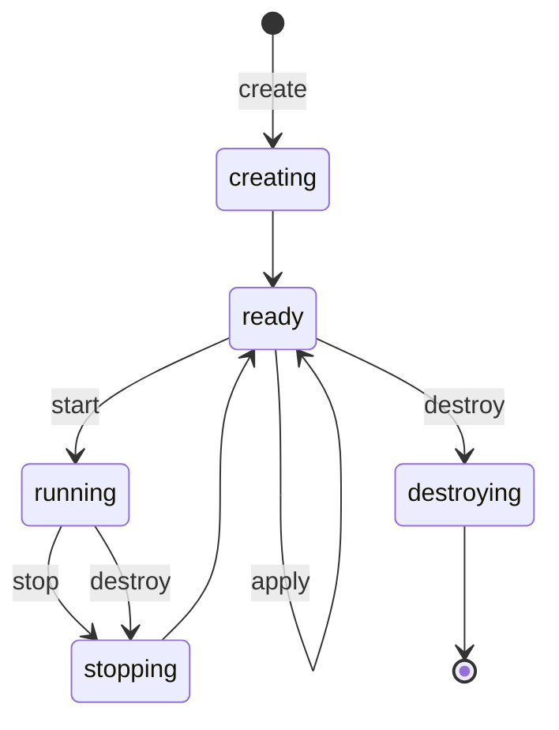

<!--
SPDX-FileCopyrightText: 2026 Paul Galbraith
SPDX-License-Identifier: GPL-3.0-only
-->

# Machine blueprints and machines

> **Status:** implemented for the QEMU subset. The following all
> ship today: materializing a machine and the lifecycle CLI
> (`create-machine` / `start-machine` / `stop-machine` /
> `destroy-machine` / `recreate-machine` / `apply-blueprint` /
> `list-machines`, with `--blueprint` / `--machine` selection),
> exclusive per-machine operation locks, operation generation
> counters, and reconciling an interrupted transitional phase
> (`creating` / `stopping` / `destroying`) on startup. **A run
> stores nothing on the machine** — `run-script` returns its output
> to whoever ran it (D36), so there is no run directory, and there
> never was one in this model. Clone and export are not built yet
> (proposed/FEATURES.md); the old root-home machine model has been
> removed and replaced by this one.

A **blueprint** is a reusable, user-owned JSON file that describes a
kind of machine. A **machine** is one instance of that blueprint: it
has its own writable disks, its own backend object, and its own
lifecycle. One blueprint can have zero, one, or many machines.
Blueprints are identified by name; machines are identified by id.

```text
<reliquary_home>/
├── blueprints/
│   └── freedos.rlqb          user-owned reusable blueprint
└── cache/machines/
    └── freedos-0/            the machine — disposable
        ├── machine.json      state; while running, the live VM
        │                     identity folds in as a `vm` section
        ├── disks/            per-machine images, by media name
        ├── screenshots/      the `screenshot` verb's captures, and
        │                     a failure's automatic one
        └── <backend>/        the backend's own files (e.g. qemu/)
```

A blueprint's name — the identity you select it by — is its
declared `name` field if it has one, otherwise its file stem
(`<name>.rlqb`), resolved from whichever directory supplies it
(docs/spec/asset-resolution.md). The name must be safe to use in an
id: it becomes part of a machine id and part of a cache directory
name. Two blueprint files that resolve to the same effective name
in one source directory is an error. A machine's saved state records
which file its blueprint resolved from, and `--blueprint <name>`
selection only matches machines whose recorded blueprint source
matches what resolving `<name>` produces for the current
invocation. A machine's identity is `<blueprint>-<n>`, where `<n>`
is the lowest non-negative integer not already used by that
blueprint at the time `create-machine` runs (destroying a machine
frees its number for reuse). This allocation is serialized with a
per-blueprint lock file under `cache/machines/.locks/`, so two
concurrent `create-machine` calls for the same blueprint can't pick
the same number. The cache directory, any run directories, and the
backend identity all use the machine id — there is no separate
machine name. A machine **is** its cache directory: nothing about a
machine exists outside `cache/`, because a machine is created and
destroyed as a single unit. Deleting the cache directory deletes
the machines — that's by design. A run stores nothing in the
cache; it returns its output to whoever called it (D36), and that
caller decides what to do with it (P4, P18; see the return model in
the script spec).

Commands select their target machine with explicit flags, never by
position:

- `--blueprint <name>` — that blueprint's one machine, when exactly
  one exists
- `--machine <id>` — the full machine id, exactly (no partial-id
  matching, no bare number by itself)

On a command that acts on one machine, `--blueprint <name>` alone
fails if several of that blueprint's machines exist (the error
lists the candidate ids) or if none exist (the error suggests
running `create-machine`; `run-script` creates one automatically
instead of failing).

## The machine directory and out-of-band file access

`get-machine-dir` (matching API method `get_machine_dir()`)
returns the machine's cache directory as an absolute path. It's a
read-only query, usable with the standard selectors in any phase,
and it doesn't touch anything.

That path is how you reach a machine's files directly, and it's
the intended way a file crosses between host and guest — not a
workaround (D108). Reliquary never places a file on a machine's
drives, never reads one back, and never maps a volume to a guest
drive letter: **a machine's file content is deliberately out of
Reliquary's reach** — this is what **P16**'s carve-out says, not a
gap in what Reliquary does, so no supported use case needs
Reliquary to look inside a volume, and none is left unsupported by
it not doing so. While the machine is stopped, on every control
plane, the contents under `disks/` are just ordinary files on the
host: a drive whose media is a directory *is* that directory, and
image-file drives can be read and written with your own tools.
Reliquary doesn't track or manage this kind of access at all — what
the next `start` finds on the drives is simply the machine's
current state, exactly as if the guest itself had written it.

This access has limits:

- a running machine's drives must never be touched from the host —
  requiring the machine to be stopped is a hard rule, not just
  advice;
- files under `cache/media/` are off limits: they're
  hash-verified and read-only by design, and editing one breaks
  that verification, and breaks any `difference` machine built on
  top of it;
- a run's output is **not** stored on the machine for you to
  retrieve here: it's already returned to whoever ran it (D36), so
  there's nothing on the machine to read, copy, or write for that
  purpose;
- `machine.json` (including its live `vm` section) and the lock
  files are Reliquary's own internal state — do not edit them by
  hand.

## Lifecycle

A machine sits at rest in one of two phases — `ready` or
`running` — and passes through transitional phases (`creating`,
`stopping`, `destroying`) while an operation is in progress. Those
transitional phases exist so that if an operation is interrupted,
Reliquary can detect that and recover:



`destroy` removes the machine entirely — there is no partly
destroyed resting phase, because a machine is nothing more than
its cache directory. If the machine is running, `destroy` stops it
first, holding the per-machine lock across both the stop and the
destroy — the same way `restart` holds the lock across its own
stop and start — so nothing else can touch the machine in between.
`recreate` runs `destroy` and then `create` as a single command,
reusing the same id. On startup, if Reliquary finds a machine
stuck in a transitional phase, it either completes a safe rollback
automatically or fails with instructions for recovering it by hand
(see below).

```text
rlq list-blueprints
rlq list-machines [--blueprint <name>]
rlq create-machine --blueprint <name>
rlq start-machine (--machine <id> | --blueprint <name>) [--display]
rlq stop-machine (--machine <id> | --blueprint <name>)
rlq apply-blueprint (--machine <id> | --blueprint <name>)
rlq destroy-machine (--machine <id> | --blueprint <name>)
rlq recreate-machine (--machine <id> | --blueprint <name>)
rlq delete-blueprint <name>
```

The mobility commands — `clone-machine`, `export-drive`,
`export-machine` — are **not built yet** (see the status banner
above; "Machine mobility" in planning/proposed/FEATURES.md), so
they are not documented here: this spec describes what currently
exists. Their settled design lives in [api.md](api.md), which
describes the end-goal design rather than what's shipped.

`list-blueprints` shows each blueprint and how many machines it
has; `list-machines` shows each machine's id, blueprint, phase,
and backend. Both commands work by scanning `cache/machines/`.
`create-machine` validates and resolves the current blueprint,
then materializes a new machine under the next free
`<blueprint>-<n>` id — its state, its writable drives, and its
backend object — and prints the new id. `destroy-machine` deletes
the machine entirely: the whole cache directory and the backend's
own machine object, stopping the machine first if it's running.
`recreate-machine` runs `destroy-machine` followed by
`create-machine` as a single command, reusing the same id.
`delete-blueprint` takes only `--blueprint`: it deletes the
blueprint file itself, and refuses to run while any machine of
that blueprint still exists — the error names those machine ids,
so you destroy them first.

Editing a blueprint only affects machines created after the edit —
it has no effect on machines that already exist. When a machine is
created, Reliquary records the source blueprint and a digest of its
resolved contents; that recorded snapshot is the machine's
baseline.

**The baseline covers only the machine's shape — nothing else.**
Two blueprint fields are deliberately left out of it, and are read
straight from the blueprint file every time instead: `parameters`,
which feeds script property binding, and `scripts`, the label →
file-stem map that `run-script <label>` looks a label up in.
Neither of these decides what the machine *is* — they only say what
to run against it and what values to bind into that run — so
neither is recorded in the baseline, neither is part of the digest,
and neither needs `apply` to take effect. A label added to a
blueprint after its machine already exists can be run immediately.
If a machine's blueprint file has since been moved or deleted, the
machine simply has no `parameters` or `scripts` to read — its own
recorded state still fully describes its shape (D101). Between
calls to `apply`, the machine's own recorded state is what's
authoritative, not the blueprint file: a script's `insert`/`eject`
writes to that state, so a machine can legitimately end up
different from its baseline. `start` runs the machine exactly as
its own saved state describes, and never re-reads the current
blueprint file. Adopting blueprint edits into an existing machine —
and bringing a machine that has diverged back to its blueprint's
shape — is what the explicit `apply` command is for: with the
machine stopped, it re-resolves the current blueprint and
reconciles the machine to it. Differences it can apply directly
(memory, boot order, backend settings, drives turned on or off,
media changes) are applied, and the machine's recorded digest is
updated. Differences it cannot absorb without recreating the
machine — such as a changed `size` on a disk image that already
exists — cause `apply` to fail, naming both the old and new values;
in that case `recreate` is the way to make the change happen.
`start` never applies a newer blueprint on its own. **And the
reverse never happens either**: no command writes a machine's own
divergence — an inserted medium, a changed boot order — back into
its blueprint file. The blueprint is the file you author: Reliquary
writes to it at most once, when it's first created
(`new-blueprint`, `add-media`), and only ever reads it after that.
If you decide a shape you set up at the machine should become
permanent, you type it into the blueprint yourself and bring it in
with `apply` — that's the only direction changes flow. An
arrangement a script set up for one run is not meant to become a
permanent fact about the machine (U24); a machine left in whatever
state a run arranged is exactly what the `with` scope and `apply`
exist to undo (U26). So a command that copied the machine's current
state back into the blueprint would be writing state into the wrong
one of the two (D30, D41). The one case where a machine's shape
genuinely needs to be *captured* into a blueprint is a VM Reliquary
did not create itself — that's what `import-vm` is for, and it
writes a new blueprint exactly once.

`clone` creates a new machine under the next free `<blueprint>-<n>`
id. It keeps the same resolved blueprint snapshot as the source
machine, but copies the source machine's writable drives if they
exist. So a clone is a copy of a machine, not a second name for the
same blueprint. A possible future `fork-blueprint` command could
create a new, separately editable blueprint from a machine, but
`clone` deliberately does not do that itself.

## The machine state

The blueprint is still the plain JSON object described in the
[machine blueprint](../blueprint-guide.md) guide. A machine's state
lives in exactly one file, `cache/machines/<id>/machine.json`. It
holds the resolved blueprint fields plus the machine's own
bookkeeping — it does not re-declare the blueprint schema:

```json
{
  "id": "freedos-0",
  "blueprint": "freedos",
  "created": "2026-07-19T18:20:11Z",
  "phase": "ready",
  "...": "resolved blueprint fields, backend-id, blueprint-digest"
}
```

It contains the machine's own id, repeated inside the file as a
safety check — this id must match the name of the directory it sits
in, so a hand-copied or misplaced machine directory is refused
rather than used. It also contains the source blueprint's name, the
creation time, the lifecycle phase, the operation generation
counter, the resolved blueprint digest, the backend ID, and the
drive and controller addresses as they were actually assigned.
While the machine is running, it also carries a `vm` section: the
live VM's identity, as every backend adapter records it — the
`backend` that owns the VM, that backend's own identifier for the
VM (`backend-id`), a token generated fresh each time the machine
starts (`token`), an endpoint whose shape depends on the adapter
(`endpoint`), and, when the backend runs as a host process, that
process's id (`pid`). This `vm` section is written atomically
together with `phase`, so the two can never disagree with each
other, and it's cleared when the machine stops. Never edit it by
hand.

Only the backend named in the record is allowed to interpret its
endpoint. A same-named VM belonging to a different `home` directory
is never mistaken for this one: the identifier alone isn't enough
to authorize a command against it, because an addressable endpoint
can outlive the VM that originally owned it — so the per-start
token is checked too.

Alongside the resolved shape, the state also carries one
**recorded observation** — a fact read from how the machine was
actually materialized, which is not part of the blueprint digest.
For each floppy drive, `launch-size` records the byte size of the
medium that was attached when the machine last launched. That size
fixes the drive's geometry for the boot, and it's what causes
Reliquary to refuse a live media swap that the drive's geometry
couldn't support (U20). It is nothing more than a file size —
**nothing here reads the contents of a disk** — so no volume count,
partition table, or filesystem fact is ever recorded (D108).

The phase is always one of `creating`, `ready`, `running`,
`stopping`, or `destroying`. Every operation that changes a machine
takes an exclusive per-machine lock before it inspects the
backend's state. On startup, if Reliquary finds an interrupted
phase, it verifies the backend's identity and either completes a
safe rollback or fails with explicit instructions for recovering by
hand. JSON files are written atomically, which protects the file
itself from corruption — but that doesn't make a host file write
and a hypervisor operation into one single transaction, so the two
can still end up out of sync if the hypervisor call itself fails
partway.

There is no limit on how many machines can run at once within a
`home` directory. The per-machine lock and the per-start identity
check already make running several machines at once safe — each
machine has its own cache directory, its own backend object, and
its own endpoint — so the real limit is just host resources
(memory, and whatever else the backend needs per machine), and
you'll simply see that as an ordinary `start` failure when you hit
it. Reliquary does not impose any additional cap of its own.

There is no `installed` field recording whether a script succeeded.
A script's outcome is entirely in the output the run returns to
whoever called it (D36) — the script's name, its source digest, its
result, and any artifacts it produced — never a value stored on the
machine claiming something about the guest's contents. A run stores
nothing in the cache; saving runs into a persistent record archive
is backlogged asynchronous-run work (proposed/FEATURES.md
"Asynchronous runs"), and until then, it's up to whoever calls
`run-script` to keep whatever part of the output they need.

## Naming and identity

You author and rename blueprints by editing `.rlqb` files under an
asset directory. Machines are never renamed, because the machine
id is its entire identity: `<blueprint>-<n>`, assigned when
`create-machine` runs (using the lowest free number) and freed for
reuse when the machine is destroyed. Manually renaming a machine
directory under `cache/machines/` is not supported. **And there is
no alias for a machine, generated or user-chosen**: the id is
already a readable pair of blueprint name and number, so a
generated nickname would just be a second name to keep in sync with
it, for no benefit. A blueprint's several machines are
interchangeable instances of the one thing it declares (P1) — a
machine that differs in kind belongs to a different blueprint — so
Reliquary has no way to tell two machines of the same blueprint
apart beyond their number. What each machine is actually *used
for* is something only the caller keeps track of, not Reliquary
(P4).

## JSON remains the format

The blueprint (its machine, media, source, and archive sections)
and the machine state both remain JSON. They are declarative
documents with strict schemas, which gets you editor autocomplete,
stable formatting, and precise error messages. The script language
remains a separate, line-oriented format for describing behavior.
Reliquary publishes one composed-blueprint JSON Schema, versioned
and packaged as
[blueprint-schema-v1.json](../../Reliquary/schemas/blueprint-schema-v1.json),
so editors can use it today. That schema is kept in sync with the
prose specs, which remain the normative source of truth; Reliquary's
own validation logic is the parser's, and a shared corpus of valid
and invalid fixtures is run against both the parser and the schema
whenever they're realigned, to keep the two consistent with each
other. The machine-state schema is maintained alongside this spec
([machine-state.schema.json](../../src/reliquary/schemas/machine-state.schema.json));
its version tracks the Reliquary release, not a version field
inside user documents — that only applies before 1.0.
