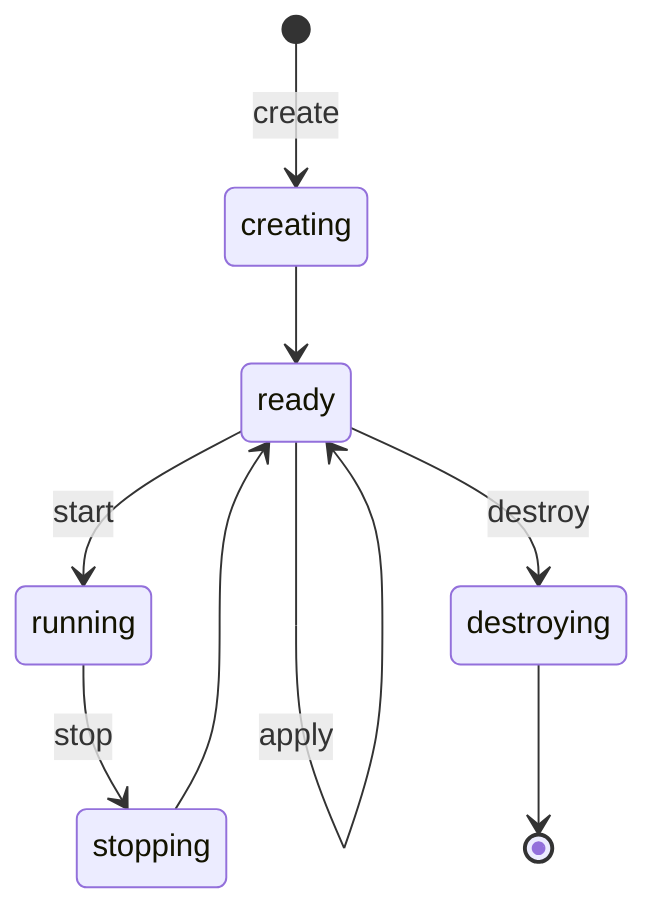

<!--
SPDX-FileCopyrightText: 2026 Paul Galbraith
SPDX-License-Identifier: BSD-3-Clause
-->

# Machine blueprints and machines

> **Status:** implemented for the QEMU subset. Materialization and
> the lifecycle CLI (`create-machine` / `start-machine` /
> `stop-machine` / `destroy-machine` / `recreate-machine` /
> `apply-blueprint` / `list-machines`, `--blueprint` / `--machine`
> selection), exclusive per-machine operation locks, operation
> generations, and startup reconciliation of interrupted
> transitional phases (`creating` / `stopping` / `destroying`) all
> ship. **A run stores nothing in the machine** — `run-script`
> returns its output to whoever drove it (D36), so there is no run
> directory and never was one on this model. Clone and export
> remain unbuilt (proposed/FEATURES.md); the legacy root-home
> machine model was absorbed and deleted.

A **blueprint** is a reusable, user-owned JSON description of a kind of
machine. A **machine** is one realization of that blueprint: its
writable disks, backend object, and lifecycle. One blueprint
may have zero, one, or many machines. Blueprints have names; machines
have ids.

```text
<reliquary_home>/
├── blueprints/
│   └── freedos.rlqb          user-owned reusable blueprint
└── cache/machines/
    └── freedos-0/            the machine — disposable
        ├── machine.json      state; while running, the live VM
        │                     identity folds in as a `vm` section
        ├── media/            per-machine images, by media name
        ├── screenshots/      the `screenshot` verb's captures, and
        │                     a failure's automatic one
        └── <backend>/        the backend's own files (e.g. qemu/)
```

A blueprint's name — its identity, the selection key — is its
declared `name` field when it carries one, else its file stem
(`<name>.rlqb`), resolved from whichever source supplies it
(docs/spec/asset-resolution.md). It must be
id-safe: it becomes a machine-id segment and a cache directory
name. Two assets of one kind resolving to one effective name in a
source are an error. The machine's state records which file it
resolved from, and name selection matches only machines of the
invocation's own resolution. A machine's
identity is `<blueprint>-<n>`, where `<n>` is the lowest free
non-negative integer for that blueprint at `create` time (destroy
frees the number for reuse). Allocation is serialized with a
per-blueprint lock under `cache/machines/.locks/`. The cache
directory, run directories, and backend identity all use the
machine id, and there is no separate machine name. A machine
**is** its cache directory — nothing about a machine lives
outside `cache/`, because a machine lives and dies as one thing.
Deleting the cache deletes the machines, by design. A run stores
nothing in the cache — it returns its output to the caller (D36),
which keeps whatever is worth keeping on its own side of the seam
(P4, P18; the return model — script spec).

Commands select their targets with explicit flags, never
positionally:

- `--blueprint <name>` — that blueprint's machine when exactly one
  exists
- `--machine <id>` — the full machine id, exactly (no prefix
  matching, no bare-number form)

On machine-level verbs, `--blueprint <name>` alone fails when
several machines exist (listing the candidate ids) or when none
exist (suggesting `create-machine`; `run-script` creates one
instead).

## The machine directory and out-of-band access

`get-machine-dir` (twin `get_machine_dir()`) returns the
machine's cache directory as an absolute path — a query under
the standard selectors, valid in any phase, touching nothing.

The path is the door to **out-of-band file exchange**, the
sanctioned way files cross the host/guest boundary (owner,
2026-07-22 — the run-collection model was dropped; the in-band
*directory* operations remain a deferred capability,
planning/proposed/FEATURES.md "Horizon", while single-file
in-band exchange landed at milestone 9 as `put-file` /
`get-file`). While the machine is stopped on every control
plane, the content under `media/` is plain host state: a drive
whose media is a directory *is* that directory, and image drives
are readable and writable with the user's own tools. Reliquary
neither mediates nor records out-of-band access — what the
next `start` finds on the drives is simply the machine's state,
exactly as if the guest had written it.

The blessing has edges:

- a running machine's drives are never touched from the host —
  the stopped requirement is the contract, not advice;
- `cache/media/` payloads stay outside it: hash-verified and
  read-only by doctrine, and rewriting one breaks verification
  and any `difference` machine backed by it;
- a run's output is **not** in the machine to be custodied: it
  returns to whoever drove it and is already on their side of the
  seam (D36), so there is nothing here to read out, copy, or
  write into;
- `machine.json` (its live `vm` section included) and lock files
  are Reliquary's own state, not an editing surface.

## Lifecycle

A machine rests in one of two phases — `ready` or `running` — and
passes through transitional phases (`creating`, `stopping`,
`destroying`) that exist so an interrupted operation is
detectable and recoverable:



`destroy` removes the machine entirely — there is no
half-destroyed resting phase, because a machine is nothing but
its cache directory. `recreate` is `destroy` + `create` as one
command, reusing the same id; `clone` and `export` require
`ready`. On startup Reliquary detects a machine stranded in a
transitional phase and completes a safe rollback or fails with
recovery instructions (see below).

```text
rlq list-blueprints
rlq list-machines [--blueprint <name>]
rlq create-machine --blueprint <name>
rlq start-machine (--machine <id> | --blueprint <name>) [--display]
rlq stop-machine (--machine <id> | --blueprint <name>)
rlq apply-blueprint (--machine <id> | --blueprint <name>)
rlq destroy-machine (--machine <id> | --blueprint <name>)
rlq recreate-machine (--machine <id> | --blueprint <name>)
rlq delete-blueprint <name>
rlq clone-machine (--machine <id> | --blueprint <name>)
rlq export-drive <key> <destination>
    (--machine <id> | --blueprint <name>)
rlq export-machine --to <exporter> [<destination>]
    (--machine <id> | --blueprint <name>)
```

`list-blueprints` shows each blueprint and its machine count;
`list-machines` shows each machine's id, blueprint, phase, and
backend — both enumerated by scanning `cache/machines/`.
`create-machine` validates and resolves the current blueprint,
materializes a new machine under the next free `<blueprint>-<n>`
id — state, writable drives, backend object — and prints the id.
`destroy-machine` deletes the machine entirely: the whole cache
directory and the backend machine. `recreate-machine` is
`destroy-machine` followed by `create-machine` as one command,
reusing the same id. `delete-blueprint` takes only `--blueprint`: it
removes the blueprint file itself and fails closed while any
machine of it exists, naming the machine ids — destroy them
first.

Editing a blueprint affects future `create` operations, not existing
machines. Each machine records the source blueprint and resolved digest at
creation; that resolved snapshot is the machine's baseline. Between
`apply`s the machine's own state is authoritative — script
`insert`/`eject` persists there, so a machine may legitimately
diverge from its baseline — and `start` runs the machine as its
state describes, never re-reading the current
blueprint file. Adopting blueprint edits — and returning a
diverged machine to its blueprint shape — is the explicit `apply`: with the
machine stopped, it re-resolves the current blueprint and reconciles the
machine to it — applicable differences (memory, boot order, drives
enabled or disabled, media changes) are applied and the recorded
digest updated; contradictions the machine cannot absorb without
regenerating (such as a changed `size` on an existing image) fail
closed naming both sides, leaving `recreate` as the honest
alternative. Applying a newer blueprint never happens implicitly at
`start`.

`clone` creates a new machine under the next free
`<blueprint>-<n>` id. It retains the same
resolved blueprint snapshot but copies the source machine's writable drives
when they exist; it is therefore a snapshot of a machine, not another
name for a blueprint. A future `fork-blueprint` command may create a new editable blueprint; it
is intentionally not implicit in clone.

## The machine state

The blueprint remains the plain machine JSON object described by the
[machine blueprint](../blueprint-guide.md). The machine's one document is
`cache/machines/<id>/machine.json` — the resolved
blueprint fields plus the machine's own bookkeeping, not a second
spelling of the blueprint schema:

```json
{
  "id": "freedos-0",
  "blueprint": "freedos",
  "created": "2026-07-19T18:20:11Z",
  "phase": "ready",
  "...": "resolved blueprint fields, backend-id, blueprint-digest"
}
```

It contains the machine's own id (repeated inside the file as a
safety check — it must match the directory it sits in, so a
hand-copied or misplaced machine directory fails closed), the
source blueprint name, creation time, lifecycle phase, operation
generation, the resolved blueprint digest, backend ID, and realized
drive/controller addresses. While running it also carries a `vm`
section (name, uuid, port, pid) — the live-VM identity, written
atomically with `phase` so the two can never disagree, and cleared
when the machine stops. It must never be edited by hand.

The phase is one of `creating`, `ready`, `running`, `stopping`,
or `destroying`. Every mutating operation takes an exclusive
per-machine lock before inspecting backend state. On startup
Reliquary detects an interrupted phase, verifies backend
identity, and either completes a safe rollback or fails with
explicit recovery instructions. Atomic file replacement protects
JSON writes; it does not pretend a host file write and a
hypervisor operation are one transaction.

No home-wide limit caps how many machines run at once. The
per-machine lock and per-start identity model already make
concurrency safe — each machine is its own cache directory, its
own backend process, and its own auto-allocated port — so the
honest ceiling is host resources (memory, free ports), surfaced
as an ordinary `start` failure. Reliquary invents no cap of its
own.

There is no `installed` boolean. A script's outcome is the output
the run returns to the caller (D36) — naming the script, its
source digest, result, and produced artifacts — never a stored
claim about the guest's contents. The run stores nothing in the
cache; persisting a run into a record archive is
asynchronous-runs backlog work (proposed/FEATURES.md "Asynchronous
runs"), and the consumer keeps whatever output is worth
keeping.

## Naming and identity

Users author and rename blueprints by changing `.rlqb` files
under an asset root.
Machines are never renamed because the id is the whole identity:
`<blueprint>-<n>`, assigned at `create` (lowest free number) and
reused after `destroy`. Manual renames of machine directories under
`cache/machines/` are unsupported.

## JSON remains the format

The blueprint (its machine, media, source, and archive components)
and the machine state remain JSON. They are declarative documents
with strict schemas and benefit from editor completion, stable
formatting, and precise diagnostics. The script language remains the
separate line-oriented behavioral format. Reliquary publishes one
composed-blueprint JSON Schema, versioned and packaged as
[blueprint-schema-v1.json](../../Reliquary/schemas/blueprint-schema-v1.json)
so editors can bind it today; it stays a synchronized companion to
the prose specs, which remain normative, with Reliquary's own
validation the parser's and a shared valid/invalid fixture corpus —
run against both parser and schema at realignment — keeping the two
honest against each other. The machine-state schema is authored
beside this spec
([machine-state.schema.json](../../reliquary/schemas/machine-state.schema.json)); the schema
version tracks the Reliquary release, not a version field in user
documents before 1.0.
