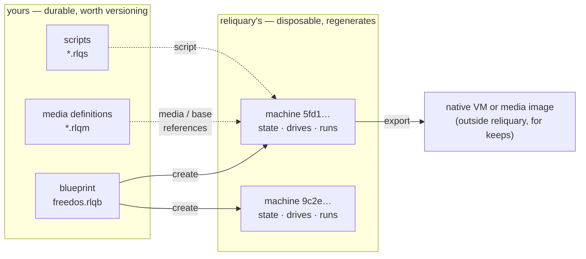
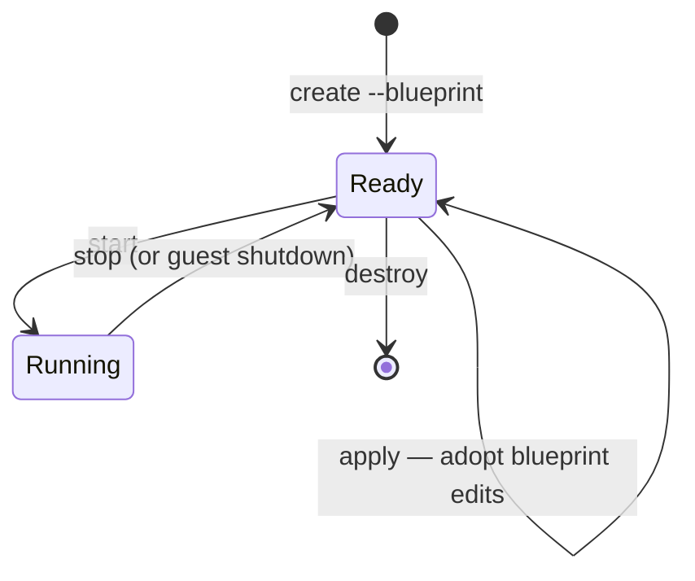

<!--
SPDX-FileCopyrightText: 2026 Paul Galbraith
SPDX-License-Identifier: BSD-3-Clause
-->

# The machine blueprint

> **Status:** the milestone-1 subset (`platform`, `memory`, `drives` with
> `size`/`media` and empty removable slots (`null`), `boot`, `name`,
> `description`, and `scripts`) is implemented: parsing, validation,
> media-name resolution, machine materialization, and persistent
> script-driven `insert`/`eject`. The remaining fields, and JSONC
> acceptance, are not implemented yet; details may still change
> before first release.

Every reliquary machine begins with a reusable JSON **blueprint** and is
realized as separately identified **machines**. One blueprint can create
many machines. The detailed ownership, state, locking, and recovery
model is in [Machine blueprints and machines](instance-model-design.md).

## The model at a glance

A **blueprint** is a design you author and keep. A **machine** is
a disposable realization reliquary builds from it — identified by
a generated id, cheap to destroy and rebuild, never the product.
When a result should outlive its machine, `export` carries it out.



Each machine then moves through a small lifecycle. Solid states
are where a machine rests; every verb is explicit, and nothing
tears a machine down or adopts a blueprint edit implicitly:



`recreate` is exactly `destroy` + `create` as one command, under
the same id; `clone` and `export` act on a Ready (stopped)
machine. What each verb touches:

| verb       | blueprint file           | the machine (`cache/machines/<id>/`)   | API twin           |
|------------|--------------------------|----------------------------------------|--------------------|
| `create`   | reads                    | materializes, under a new id           | `create_machine`   |
| `start`    | —                        | runs (as its state describes)          | `start_machine`    |
| `stop`     | —                        | powers off                             | `stop_machine`     |
| `apply`    | reads                    | reconciles to edits, new baseline      | `apply_blueprint`  |
| `destroy`  | —                        | deletes entirely                       | `destroy_machine`  |
| `recreate` | reads                    | regenerates, same id                   | `recreate_machine` |
| `clone`    | —                        | new machine, new id, drives copied     | `clone_machine`    |
| `delete`   | deletes (refuses while machines exist) | —                        | `delete_blueprint` |
| `export`   | —                        | copies out                             | *(with export's shape)* |

Every verb lands on the CLI and the embedding API together
(planning/INTERFACES.md): the twins are flat functions — the
shape every binding language can express — taking the same
selectors the CLI takes (a machine id, or the
blueprint/machine-number pair, with `resolve_machine()` the
shared resolution seam) plus the mirrored global keywords
(`home=`, `assets=`, `assets_only=`). Returns mirror what the
CLI prints — `create_machine` and `clone_machine` return the new
machine id — and errors raise by class where the CLI exits by
code. `import`'s twin is `import_vm`, because a bare `import` is
a Python keyword in the first binding; `export`'s twin is
deliberately unnamed until export's own shape settles — a named
omission, not drift.

Two rules carry the whole model:

- **Editing the blueprint never changes an existing machine by
  itself.** A machine keeps the resolved snapshot it was created
  from (its *baseline*); `apply` is the explicit step that adopts
  your edits. Between `apply`s the machine's own state is
  authoritative — operation (installer writes, script
  `insert`/`eject`) may legitimately diverge it from the
  baseline, and `start` runs the machine as its state describes,
  never silently reverting it.
- **Everything reliquary materialized is disposable.** `destroy` +
  `recreate` rebuilds a machine wholesale from the blueprint,
  media definitions, and scripts; nothing under `cache/` is ever
  precious.

## The documents

```text
<reliquary_home>/blueprints/
└── msdos.rlqb               reusable blueprint — yours
<reliquary_home>/cache/machines/<id>/
├── reliquary-machine.json   the machine's state — reliquary's
├── drives/                  the machine's disk and floppy images
├── runs/                    append-only run records (transcripts,
│                            screenshots, collected outputs)
└── ...                      backend files and logs
```

- The **blueprint** (`<name>.rlqb`) is the reusable machine shape
  you defined. You own it: reliquary reads it and never writes it.
- The **state** (`cache/machines/<id>/reliquary-machine.json`)
  describes one machine: its identity, blueprint, lifecycle
  phase, and resolved configuration, at the root of the
  machine's directory — which holds everything reliquary
  materialized for it: state, disk images, run records, backend
  files. The machine **is** this directory; nothing about a
  machine lives outside `cache/`, because a machine lives and
  dies as one thing. reliquary writes all of it; the one part
  written *for you* is `runs/` — the machine's run records
  (transcripts, screenshots, collected outputs), which the world
  reads in place and copies out to keep (see below). Everything
  else you never need to touch.

The split reflects what reliquary machines are for: **ephemeral
work**. A reliquary machine is a disposable rig — created to run a
scripted OS install or an automated task, recreated freely, and
deleted when done. The blueprint makes rebuilding cheap; the
entire cached materialization is safe to throw away, because
everything in it — run records excepted — regenerates from
blueprints, media definitions, and scripts. The records are
evidence of runs, delivered live to whoever drove them and
retained until the machine goes; they are the one thing in the
cache no re-run reproduces. The machine is never the product —
often the run record is (U3): the point was to run some tests,
and the record is copied out as plain files when it should
outlive the machine
([the record contract](script-spec-design.md#failure-runs-and-transcripts)).
When the durable thing is bigger, `export` it — either a media
image (a disk image taken out of the machine) or the entire
machine, handed to a hypervisor built for long-lived machines.
reliquary is not the place to keep a machine you care about.

The same ownership line runs through the whole reliquary home:
everything outside `cache/` is durable data you own. Machine
blueprints, media definitions, and scripts are small, shareable,
and worth versioning. The [user property registry](property-registry-design.md)
is also durable but personal and normally not shared or committed. A
media definition may initially be installed from an embedded script
block, after which its library copy is likewise user-owned. Everything
under `cache/` is reliquary's and disposable — and, run records
excepted, reconstructible: the records are evidence, kept for the
machine's life and never regenerable, so copy out any record that
should outlive its machine. There is no dropping
of pre-created files into cache directories; inputs enter machines
through the blueprint —
[`media` references](machine-blueprint-reference-design.md#media--optional--string)
and [starting-point
images](machine-blueprint-reference-design.md#base--optional--string-or-object)
that machine drives are differenced from, or copies of.

This page explains the format and how these documents behave
through a machine's life. Companion pages:

- **[Field reference](machine-blueprint-reference-design.md)** — every field,
  every rule.
- **[Cookbook](machine-blueprint-cookbook-design.md)** — complete worked
  examples.
- **[The media spec](media-spec-design.md)** — the media library, including
  definitions that scripts can install before machine resolution.
- **[The user property registry](property-registry-design.md)** — reusable
  personal values and protected secrets bound to script inputs.

## What the blueprint format is

**It is backend-agnostic.** The same blueprint can describe a
machine on any supported virtualization backend — QEMU,
VirtualBox, VMware Workstation, or Hyper-V. Nothing in the core
format is a QEMU option or a VirtualBox setting in disguise. The
one deliberate exception is the
[`backend-settings`](machine-blueprint-reference-design.md#backend-settings)
field, an explicitly scoped escape hatch; a blueprint that
doesn't use it is portable by construction — one checked-in
blueprint serves every developer's host (U4).

**A blueprint and its state are not the same format.** The blueprint is the
portable JSON document you author. The reliquary-owned machine
state wraps its resolved form with identity, lifecycle, and
backend facts. See [the instance model](instance-model-design.md).

**Blueprints have names; machines have ids.** A blueprint's name is its file
stem (`<name>.rlqb`). A machine's identity is `<blueprint>-<n>` — commands take
`--machine <blueprint>-<n>`, or `--blueprint <name> --machine <n>`,
and `--blueprint <name>` alone selects a blueprint's machine when
exactly one exists. Destroy frees the number for reuse on the next
`create`. Selection by name is scoped to the invocation's
resolution: a machine matches only when the name resolves —
through the asset root — to the same blueprint file the machine
[records](machine-blueprint-reference-design.md#blueprint-source), so
same-named blueprints in different projects never select each
other's machines.

## A first example

A minimal blueprint that boots a DOS floppy image:

```json
{
  "platform": "dos",
  "drives": {
    "floppy": "msdos622-boot"
  }
}
```

Save it as `msdos.rlqb` anywhere under your asset root — the
current directory by default, or the reliquary home for the
shared personal collection; a `blueprints/` subdirectory is
optional organizational dressing (../planning/ROADMAP.md, "Authored-asset
resolution"). Blueprints arrive written by hand, seeded
out of the
[codex](codex-design.md) (implicitly on first
reference, or explicitly with `pull`), synthesized from a native
VM by `import`, or scaffolded by the future `init` command —
then create a machine from it and run it:

```powershell
rlq create --blueprint msdos
rlq start --blueprint msdos --display
rlq stop --blueprint msdos
```

`create` resolves the blueprint against an assigned backend,
materializes the machine under its id-named cache, and prints the
new id. With only one machine of the blueprint, `--blueprint msdos` selects
it everywhere; `--machine msdos-0` or `--blueprint msdos --machine 0`
always works and is required once a blueprint has several machines.

## Blueprint and state

### The blueprint — yours

A `.rlqb` file holds the machine shape as you defined it —
the file you authored, and whatever you edit it to later. Write as
little as possible and let resolution fill in the rest:

- Omit `backend` and reliquary picks the best available one.
- Omit `memory`, `cpus`, or `control-planes` and the platform's
  defaults apply.
- Use shorthand: `"hdd"` instead of `"hdd0"`, a bare media-name
  string instead of an object.

Omissions are preserved, not baked in: a blueprint that omits
`memory` keeps tracking the platform default, even if that default
changes in a later reliquary.

A blueprint may not contain
[state-only fields](machine-blueprint-reference-design.md#state-only-fields);
`create` rejects a document carrying them.

**Editing the blueprint is the supported way to reconfigure a
machine — through the explicit `apply`.** A machine created from
a blueprint keeps the *resolved snapshot* of that blueprint as its
baseline; editing the blueprint file changes future `create`
operations, not existing machines. To adopt blueprint edits into an
existing machine, stop it and run
[`apply`](#applying-blueprint-edits). Nothing is ever adopted
implicitly at `start`.

### The state — reliquary's

`cache/machines/<id>/reliquary-machine.json` describes the machine as
it actually is, and reliquary maintains it: whenever reliquary
changes the machine — inserts media, changes memory, reorders
boot devices — it updates the state in the same operation. A
state document that disagrees with the hypervisor's actual
configuration is a bug in reliquary, not an ambiguity you have to
resolve.

The state is fully resolved:

- shorthand keys and values are canonicalized (`"hdd"` → `"hdd0"`,
  a bare media name → a `media` object);
- platform defaults are materialized into explicit values;
- the assigned `backend` is recorded, along with the state-only
  fields: the machine's own `id` (repeated in the file as a safety
  check against a misplaced or hand-copied machine directory),
  `backend-id`, the resolved blueprint digest, and the blueprint's
  resolved source path — plus the
  machine's bookkeeping: its blueprint's name, creation time, and
  lifecycle phase. (Script outcomes live in run records — there
  is no `installed` flag.)

The blueprint from the [first example](#a-first-example)
produces, on a host where QEMU was selected:

```json
{
  "id": "5fd11917-147a-4b6b-b7f6-9f4b6d7d1ab2",
  "blueprint": "msdos",
  "created": "2026-07-19T18:20:11Z",
  "phase": "ready",
  "platform": "dos",
  "backend": "qemu",
  "backend-id": "reliquary-msdos-8c41",
  "memory": 16,
  "cpus": 1,
  "drives": {
    "floppy0": {"media": "msdos622-boot"}
  },
  "boot": ["floppy0"],
  "control-planes": ["agentless-display"]
}
```

Don't edit the state — or anything else under
`cache/machines/<id>/`. reliquary rewrites the state as it
operates the machine, and reconciliation regenerates the backend's
configuration from the state; hand edits
are overwritten without notice. There is never a reason to: the
blueprint is your interface.

reliquary rewrites the state carefully: in the same operation as
the machine change it records, atomically
(write-temp-and-replace), and in canonical formatting — strict
JSON, stable key order, two-space indent, UTF-8, trailing
newline.

### Reconciliation at `start`

Every `start` brings the machine's state and the backend back into
line. The state document — not the baseline — is what the machine
runs as; the baseline enters only through `create` and `apply`:

1. The machine's state is loaded and validated against the resolved
   baseline's *shape* — its drive slots, hardware, and capabilities —
   without reverting divergent content. The blueprint file itself
   is not re-read; adopting blueprint edits is `apply`'s job.
2. Every media item the state references — including media a script
   attached — is resolved from the visible media catalog and
   hash-verified (and fetched if missing or stale — see
   [the media spec](media-spec-design.md)); the machine never boots
   against silently changed media. A script installs its embedded
   definitions into the library before this reconciliation.
3. The state is compared with the actual backend machine (verified
   by identity — see [backend assignment](#backend-assignment)),
   and differences reliquary can apply to the backend — its
   configuration regenerated to match the state — are applied.
4. Contradictions reliquary cannot reconcile — an unknown
   `backend-id`, a missing image file, a capability the backend
   lacks — stop the start with an error naming both sides. Nothing
   is silently adopted from either side.

### Applying blueprint edits

```powershell
rlq apply --blueprint msdos
```

`apply` adopts the current blueprint into an existing, stopped
machine: it re-validates and re-resolves the blueprint, reconciles the
machine to the new resolution, and records the new digest as the
machine's baseline. Because it reconciles the machine *to the
blueprint*, `apply` is also how a machine that has diverged — an
interrupted install script that left its installer CD attached —
is returned to its blueprint shape. Differences the machine can
absorb without regenerating anything — memory, boot order, drives
enabled or disabled, changed `media` references, added drives —
are applied.
Differences it cannot — a changed `size` on an existing image, a
`base` change on a materialized drive — fail closed naming both
sides; `recreate` is the honest alternative when the drives
should regenerate.

### Runtime changes live in the state

Script steps and CLI commands that reconfigure a machine —
inserting installer media, ejecting a CD — update the state (and
the machine), never the blueprint. The blueprint stays what you
meant the machine to be; the state absorbs what operation has done
to it — and keeps it. An inserted medium persists across
`stop`/`start` exactly as an installer's disk writes do; the
machine has definitively diverged from its blueprint until
something changes it again. The idiom for temporary media is
symmetry inside the script: the install script inserts its
installer CD as its first act and ejects it as its last, leaving
the machine back in its default shape. A machine left diverged —
by an interrupted script, or on purpose — is returned to its
blueprint with `apply`.

To make a state-side change permanent across `apply`s, make it in
the blueprint.

### Destroying and recreating a machine

Because the blueprint lives outside the cache, a machine is
always disposable:

```powershell
rlq destroy --blueprint msdos
rlq recreate --blueprint msdos
```

`destroy` deletes the machine entirely — its directory (state,
drive images, run records: copy out any record worth keeping
first) and the backend's machine — and never
touches the blueprint; `create` makes a fresh machine from the
blueprint whenever one is wanted again. `recreate` is exactly
`destroy` + `create` as one command, reusing the same id. Drives
regenerate the way they were declared: `size` drives come back
blank, [`base` drives](machine-blueprint-reference-design.md#base--optional--string-or-object)
come back as fresh differencing disks (or fresh copies) of their
base images. An installed system that only lives in the
cached drive image is gone after `recreate` — which is the point;
if it should survive, `export` it first or produce it with an
install script that can simply run again.

Because resolution re-runs from scratch, backend assignment
re-runs too: a blueprint that doesn't pin `backend` may come
back on a different backend than before — this is the supported
way to move a machine between backends, and since the drive
images regenerate as well, they arrive in the new backend's
native formats.

### Cloning, exporting, importing

Three more lifecycle commands follow from the same model
(machine stopped, in every case):

**`clone`** duplicates a machine as a new machine under a new id
(printed like `create`'s): the clone retains the source's
resolved blueprint snapshot as its own baseline, and the source's
writable drive images (if materialized) are copied into the
clone's cache — a snapshot of a machine, not another blueprint. The
clone gets its own backend object and `backend-id`; state and
backend registration are never copied.

**`export`** takes something durable out of an ephemeral machine.
It has two targets: a **media image** — a single drive taken out
of the machine as a standalone image file — or the **entire
machine**, copied to its backend's native management, registered
where that backend normally keeps VMs with disks in its native
format. This is the first-class form of the intended endgame:
reliquary machines are ephemeral, and when something should live
on, you export it (U1). An exported machine is independent and
permanently outside reliquary's purview — reliquary will never
touch it again.

**`import <source> --platform <platform>`** goes the other way:
it produces a *blueprint* from a native backend VM — a blueprint
synthesized from the backend's machine configuration, with the
VM's disks captured as media items *in place*: each gets a
generated definition — an absolute
[`local-path`](media-spec-design.md#item-fields) at the disk where the
native hypervisor keeps it, a computed hash, no URL — and the
blueprint's drives take the items as
[`base`](machine-blueprint-reference-design.md#base--optional--string-or-object).
Import reads only a source at rest: a source VM that is running —
or suspended, its disks stable but full of mid-flight guest
state — fails closed naming the VM and its state; power it off
first. The captured images are never copied, moved, or modified;
the definition is yours, so an image that should live somewhere
more durable is moved by you and its `local-path` repointed.
Import presents two choices, never defaulted (U2) — on a
terminal an absent flag becomes a prompt naming its tradeoff,
noninteractively it is an error:

- `--snapshot` / `--no-snapshot` — whether the native hypervisor
  snapshots the disks first: the one thing import may do to the
  source VM, and only with this consent. Snapshotting pins the
  definitions to the frozen extent while the source VM stays
  free to keep running natively; the snapshot is
  reliquary-named, recorded in the generated definitions'
  `notes`, and thereafter yours in native tooling (verification
  reports a lost extent). `--no-snapshot` touches nothing — but
  running the source VM again rewrites its disks, and
  verification then refuses resolution until re-import.
- `--hdd-images (duplicate | difference)` — how machines materialize
  from the captured disks, spelled explicitly into the generated
  drives' `base.type`: `duplicate` copies the image into each
  created machine, whose drive stands alone afterward;
  `difference` is the cheapest create but keeps depending on the
  source staying byte-identical — media verification at `start`
  refuses a machine whose source has since been rewritten.

Import stops
at the blueprint — it never creates a machine; run `create` when you
want one. A machine created from an imported blueprint recreates like
any other: from its bases. Translating backend config — memory, drives, controllers —
is fine; guessing what OS is inside is not, and no backend
records it, so `--platform` is required. Use import to run
scripted, disposable experiments against a copy of a real machine
without risking the original (U2). The API twin is `import_vm` —
a bare `import` is a Python keyword — its `blueprint`,
`platform`, `hdd_images`, and `snapshot` parameters mirroring
the flags.

`delete` takes only `--blueprint`: it removes the blueprint file
itself and fails closed while any machine of it exists, naming
the machine ids — `destroy` them first. (Removing a machine is
`destroy`'s job; on `delete`, `--blueprint` names the blueprint
to remove, never a machine.)

## Backend assignment

`backend` is optional in a blueprint. When omitted, `create`
walks reliquary's internal backend priority order and assigns the
first backend that is:

1. **available** — actually installed and working on this host
   (backends are autodiscovered), and
2. **capable** — able to provide everything the blueprint asks
   for (its media, controllers, image formats, control planes).

The assignment is recorded in the state — the blueprint stays
portable — and holds for the machine's life: backend disk formats,
identifiers, and VM registration are not portable between
hypervisors, so the assignment never changes underneath a machine.
Moving to another backend is done by
[recreating the machine](#destroying-and-recreating-a-machine).

Declaring `backend` explicitly pins the choice, and fails at
`create` if that backend is unavailable or incapable, rather than
falling back to another.

Alongside the assignment, the state records `backend-id` — the
backend's own identifier for the machine. reliquary never sends a
control command to a hypervisor object until its identity matches
`backend-id`, so a stale or foreign machine is detected and
refused rather than manipulated.

## Customization seams

A blueprint is written to be seeded and customized (U5): find the
standard blueprint, copy it, change the obvious thing, run. Its
author designs the seams in, and they come in two kinds.

**Value seams** carry data into the blueprint's scripts: a user
name, a license key, which supplemental disk. The
[`parameters` field](machine-blueprint-reference-design.md#parameters)
binds [script
inputs](script-spec-design.md#inputs-properties-and-response-files) by
name — fixing a value directly in the blueprint, or referring to
a [user property](property-registry-design.md) each user defines
locally, so a license key is retrievable at use yet never checked
in.

**Composition seams** change what the guest itself shows.
Installing the German edition of Windows means German vendor
media and German installer screens — different text for the
script to watch, which no value can parameterize: script inputs
deliberately never reach watch conditions, so the control-flow
graph stays static. That seam is compositional, and the blueprint
already owns both halves: its
[`drives`](machine-blueprint-reference-design.md#drives) media
references name the vendor media, and its
[`scripts`](machine-blueprint-reference-design.md#scripts) map names the
scripts that drive it. A customized blueprint points both at the
localized pair, and each script stands alone against the media it
was written for.

## Validation: fail closed, name the problem

reliquary never guesses what a blueprint means and never
silently degrades it. Two kinds of checks apply:

**Format checks** reject malformed documents outright: unknown
fields, bad values, clashing drive slots, state-only fields in a
blueprint. See the [field reference](machine-blueprint-reference-design.md)
for each field's rules.

**Capability checks** compare the blueprint against what the
machine's backend can actually do. A blueprint can be perfectly
well-formed and still ask for something a backend cannot provide —
a differencing disk in a format without differencing support, a
SCSI controller on a backend generation without one, VNC on
Hyper-V. These fail with a *capability error* that names the
backend and the missing capability, at `create`, `apply`, or
`start` — never
by silently dropping or emulating the feature.

## Platform defaults

Omitted blueprint fields resolve from the guest platform, and
the resolved values appear in the state:

| platform | memory (MiB) | cpus | control-planes            |
|----------|--------------|------|---------------------------|
| `dos`    | 16           | 1    | `["agentless-display"]`   |
| `win9x`  | 64           | 1    | `["agentless-display"]`   |
| `winnt`  | 256          | 1    | `["agentless-display"]`   |

## Format stability: none, yet

reliquary is evolving rapidly and **maintains no backward
compatibility before at least a beta-quality release**. That
applies to the blueprint format in full:

- The format may change shape at any time, without migration
  support.
- There is no in-place upgrading of old documents, no
  compatibility parsing, no deprecated-field aliasing.
- A blueprint written for an older reliquary may simply fail
  validation after an update. The remedy is to recreate the
  machine (or update the blueprint by hand to the current format
  as documented here).

There is deliberately no version field. Versioning is
compatibility machinery, and the blueprint carries none until a real
second format version exists — no earlier than beta.

The blueprint's value grammar is JSON, and JSON only — there is
no YAML form, and none is planned. Because a blueprint is a
document you author and reliquary only ever reads (`import` and
`init` write one once, then never again), the file accepts the
JSONC dialect: JSON (RFC 8259) plus `//` and `/* */` comments
and trailing commas in arrays and objects — the dialect editors
already apply to files like `tsconfig.json`, and nothing more
(no unquoted keys, no single-quoted strings, no other JSON5
extensions). Comments are the author's margin notes — a seeded
built-in blueprint uses them to point out its customization
seams (U5) — and carry no meaning: reliquary never reads them,
and nothing normative may live in one; anything the contract
needs is a field. A blueprint without comments remains valid
strict JSON; one with them is not parseable by strict JSON
tooling — a deliberate trade. Machine-written documents are
different: the state — and every other file reliquary writes —
is strict canonical JSON, always.

## Where to next

- [Field reference](machine-blueprint-reference-design.md) — `platform`,
  `backend`, `drives` (including starting-point `base` images),
  `boot`, `control-planes`, `parameters`, `backend-settings`, and
  the state-only fields, with every rule and per-field examples.
- [Cookbook](machine-blueprint-cookbook-design.md) — complete blueprints for
  common machine shapes, with the state documents they resolve
  into.
